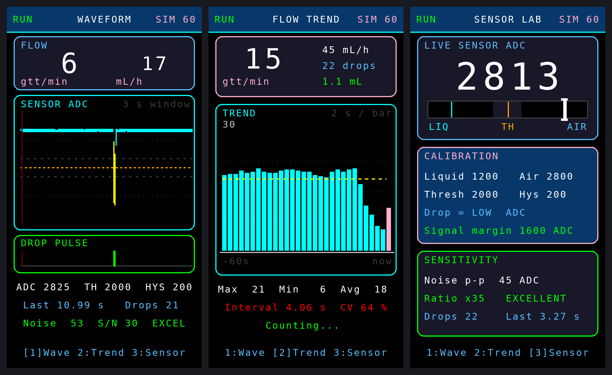

# IV-Monitor-CNB

ซอฟต์แวร์ของโครงการนวัตกรรม **Smart IV Alert** — ระบบตรวจวัดและแจ้งเตือนการให้สารน้ำทางหลอดเลือดดำ
(หอผู้ป่วยอายุรกรรม โรงพยาบาลสูงเม่น จังหวัดแพร่ / วิทยาลัยพยาบาลบรมราชชนนี แพร่)

## โครงสร้างที่เก็บ

| ที่อยู่ | คำอธิบาย |
|---|---|
| `firmware/ESP32-S3-Station-V_7_7_0/` | **เฟิร์มแวร์เครื่องประจำเตียงรุ่นล่าสุด** — ไม่ต้องคาลิเบรตด้วยมือ พยาบาลแค่หนีบเซนเซอร์แล้วเปิดโรลเลอร์ เครื่องเรียนรู้เองแล้วขึ้น READY |
| `firmware/ESP32-S3-Station-V_7_5_1/` | รุ่นก่อนหน้า — เซ็นเซอร์ IR อนาล็อก พร้อมหน้าคาลิเบรต 3 ขั้นแบบทำเอง |
| `firmware/ESP32-S3-Station-V_7_5_0/` | รุ่นก่อนหน้า — หน้าจอแนวทาง IV BAG, 4 หน้า, กราฟแนวโน้ม 30 นาที (ตรรกะตรวจจับหยดแบบเดิม) |
| `firmware/ESP32-S3-Station-V_7_6_0/` | รุ่นทดลองสำหรับเซ็นเซอร์หยดแบบเอาต์พุตดิจิทัล — นับด้วย interrupt, ผังขาใหม่ DO=5 / Buzzer=6 / ปุ่ม=7 |
| `firmware/ESP32-S3-Host-Touch-V_4_9_0/` | **เฟิร์มแวร์ Host จอสัมผัส 2.4" (v4.9.1)** — ใช้งานเหมือนสมาร์ตโฟน ตั้งค่าได้บนจอ + ปุ่ม multifunction 1 ปุ่ม + นาฬิกา DS3231 + บันทึกลงการ์ด SD |
| `firmware/ESP32-S3-Host-TFT-V_4_8_0/` | **เฟิร์มแวร์ Host จอสี TFT 2.8"** — หน้าจอแนวทาง FOCUS + จอเตือนเต็มจอ (ต่อยอดจาก v4.7.0) |
| `firmware/ESP32-S3-Host-V_4_7_0/` | **เฟิร์มแวร์ Host รุ่นตัดระบบจัดการ Wi-Fi ออก** — ทำงานเป็น Access Point อย่างเดียว รองรับมือถือพร้อมกันได้ 8 เครื่อง |
| `firmware/ESP32-S3-FlowSim-Lab/` | **เฟิร์มแวร์แบบจำลองกราฟการไหล + ทดสอบเซนเซอร์** (ไม่เชื่อมต่อ Host) — ใช้ทดลอง สาธิต และออกแบบหน้าจอ |
| `firmware/reference/` | เฟิร์มแวร์ตัวจริงที่ใช้อ้างอิง: Station v7.3.0 / v7.4.0 และ Host v4.6.0 |
| `tools/check-ino-types.py` | ตรวจว่า enum/struct ถูกประกาศก่อนจุดที่ Arduino แทรก prototype (กัน error `does not name a type`) |
| `tools/screen-preview/` | เครื่องมือเรนเดอร์ภาพหน้าจอ TFT จากไฟล์ .ino บนเครื่อง PC |
| `tools/touch-preview/` | เรนเดอร์ภาพหน้าจอของเฟิร์มแวร์ Host จอสัมผัส v4.9.0 บน PC |
| `tools/host-preview/` | เรนเดอร์ภาพหน้าจอ TFT ของเฟิร์มแวร์ Host v4.8.0-TFT บน PC |
| `tools/detector-test/` | **ทดสอบอัลกอริทึมตรวจจับหยดบน PC** 10 สถานการณ์ (ถุงแกว่ง ระดับไหล สัญญาณรบกวนแรง ฯลฯ) ไม่ต้องมีบอร์ด |
| `tools/station-preview/` | เรนเดอร์ภาพทุกหน้าจอของเฟิร์มแวร์ Station v7.7.0 บน PC (มีเซนเซอร์จำลองในตัว) |
| `tools/ui-mockup/` | แบบร่าง UI ของจอ Station 3 แนวทาง (เรนเดอร์เป็นภาพเพื่อเลือกแบบก่อนลงมือเขียนจริง) |
| `docs/screens/` | ภาพตัวอย่างหน้าจอที่สร้างจากเครื่องมือข้างต้น |
| `docs/ui-concepts/` | ภาพเปรียบเทียบแบบร่าง UI ทั้ง 3 แนวทาง |
| `docs/screens-touch/` | ภาพหน้าจอจริงของ Host v4.9.1-TOUCH ทุกหน้า |
| `docs/ui-concepts-touch/` | แบบร่าง UI แบบสมาร์ตโฟนที่ใช้ประกอบการเลือก |
| `docs/screens-host/` | ภาพหน้าจอจริงของ Host v4.8.0-TFT ทุกหน้า |
| `docs/ui-concepts-host/` | ภาพเปรียบเทียบแบบร่าง UI ของ Host ทั้ง 3 แนวทาง |
| `docs/screens-station/` | ภาพหน้าจอจริงของ Station v7.7.0 ทุกหน้า |

## เริ่มต้นที่ไหน

อ่าน [`firmware/ESP32-S3-FlowSim-Lab/README.md`](firmware/ESP32-S3-FlowSim-Lab/README.md)
ซึ่งอธิบายผังหน้าจอทั้ง 3 หน้า ตารางปุ่มกด โหมดจำลอง และขั้นตอนคาลิเบรตไว้ครบ

