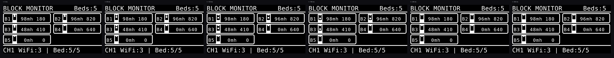

# Central Host Gateway v4.7.3-OLED — แก้อาการ Host ขึ้น OFFLINE เมื่อมีหลายเตียง + แอนิเมชันหยด

ต่อยอดจาก `ESP32-S3-Host-OLED-V_4_7_2` โครงสร้างแพ็กเก็ต ESP-NOW **ไม่เปลี่ยนแม้แต่ไบต์เดียว**
จึงใช้คู่กับ Station v7.4.x / v7.5.x / v7.7.x รุ่นใดก็ได้ (แนะนำให้อัปเดต Station
เป็น v7.5.3 หรือ v7.7.2 ด้วย เพราะสาเหตุหลักอยู่ที่ฝั่ง Station — อ่านหัวข้อถัดไป)


## อาการที่แก้: "Station ขึ้นออนไลน์ แต่ Host ขึ้น OFFLINE"

เกิดเฉพาะเมื่อมีหลายเตียงพร้อมกัน ยิ่งมากยิ่งบ่อย และไม่ได้เกิดจากสัญญาณอ่อน

### ทำไมสองฝั่งถึงไม่ตรงกัน

| ทิศทาง | จำนวนแพ็กเก็ต/วินาที | ต้องหายติดกันกี่ใบจึงขึ้นว่าหลุด |
|---|---|---|
| Host -> Station | เท่ากับจำนวนเตียง (8 เตียง = 8 ใบ) | 40 ใบ |
| Station -> Host | 1 ใบเสมอ | 5 ใบ (ของเดิม) |

Host ส่ง Sync แยกใบต่อเตียง และโค้ดฝั่ง Station ตั้ง `isHostOnline = true`
**ทุกใบที่รับได้ ไม่ว่าจะจ่าหน้าถึงเตียงใด** ฝั่ง Station จึงมีข้อมูลสำรองมากกว่า
ฝั่ง Host ถึง 8 เท่า พอแพ็กเก็ตเริ่มหาย ฝั่ง Station แทบไม่รู้สึก แต่ฝั่ง Host หลุดทันที

### แล้วทำไมแพ็กเก็ตถึงหาย

1. **สเตชันส่งชนกันเอง และชนค้างนาน** — ทุกสเตชันส่งทุก 1000 ms เป๊ะ ไม่มีการสุ่ม
   คริสตัลของบอร์ดสองตัวต่างกันราว 40 ppm = คาบเลื่อนหากันเพียง 0.04 ms ต่อวินาที
   เมื่อสองเตียงส่งห่างกันไม่ถึงความยาวเฟรม (~0.8 ms) มันจะชนกัน **ค้างอยู่ราว 40 วินาที**
   กว่าจะเลื่อนพ้นกัน ซึ่งนานกว่าเกณฑ์ 5 วินาทีหลายเท่า
2. **Host ยิง Sync รวดเดียวเป็นชุด** — `broadcastSyncToNodes()` เดิมส่ง N ใบติดกัน
   คั่นด้วย `delay(4)` อยู่ใน `loop()` ทุกวินาที เป็นการใช้คลื่นแบบกระชาก 32-50 ms
   ทับจังหวะที่ Station กำลังส่งกลับมาพอดี และยังหน่วง `loop()` ไปด้วย
3. **เกณฑ์ 5 วินาทีไม่มีระยะเผื่อ** — Station ส่งวินาทีละใบ เกณฑ์นี้จึงยอมให้หายได้แค่ 5 ใบ

### สิ่งที่แก้ในฝั่ง Host (เวอร์ชันนี้)

* **เลิกยิงเป็นชุด** — `serviceSyncScheduler()` ส่งทีละใบ ห่างกันเท่า ๆ กันตลอดวินาที
  (8 เตียง = ใบละ 125 ms) แต่ละเตียงยังได้รับครบ 1 ใบต่อวินาทีเหมือนเดิม
* **ไม่มี `delay()` ในเส้นทางส่งอีกต่อไป** — `loop()` ไม่ถูกบล็อก หน้าเว็บตอบสนองไวขึ้น
* **ค่าตั้ง/รหัสเตือนเปลี่ยน ส่งทันที** — `requestSyncNow(idx)` ดันเตียงนั้นขึ้นหัวคิว
  Station จึงรู้ภายใน ~125 ms แทนที่จะรอครบรอบ (ของเดิมรอถึง 1 วินาที)
* **`ONLINE_TIMEOUT_MS` 5 -> 8 วินาที** — ยอมให้หายติดกัน 8 ใบ เผื่อสเตชันรุ่นเก่าที่ยังไม่มี jitter
* **วัดคุณภาพลิงก์จริง** — นับว่าได้รับกี่ใบจาก 10 ใบที่ควรได้ใน 10 วินาทีล่าสุด
  แสดงทั้งบนจอ OLED และหน้าเว็บ ต่ำกว่า 60% จะขึ้นแถบ `! WEAK LINK` ให้เห็นก่อนหลุดจริง

RSSI บอกแค่ว่าสัญญาณแรงแค่ไหน แต่ **คุณภาพลิงก์บอกว่าข้อมูลหายจริงหรือเปล่า**
เตียงที่ RSSI ดีแต่ลิงก์ต่ำ = แพ็กเก็ตชนกัน ไม่ใช่สัญญาณอ่อน ซึ่งเป็นกรณีนี้พอดี

### สิ่งที่แก้ในฝั่ง Station (ต้องอัปเดตด้วยจึงจะหายขาด)

ดู [`Station v7.7.2`](../ESP32-S3-Station-V_7_7_2/README.md) หรือ
[`Station v7.5.3`](../ESP32-S3-Station-V_7_5_3/README.md) — สุ่มคาบส่งบวกลบ 60 ms
ทุกครั้ง และเหลื่อมรอบแรกตามเลขเตียง สองเตียงที่ชนกันจะแยกจากกันในรอบถัดไปทันที

### วัดผลได้

```bash
tools/link-sim/run.sh
```

จำลองจังหวะเวลาของทั้งระบบ 60 นาที เทียบของเดิมกับของใหม่ (2/4/6/8 เตียง)

| จำนวนเตียง | เวลาที่ Host ขึ้น OFFLINE ผิดพลาด (เดิม) | (ใหม่) | ช่องว่างยาวสุด เดิม -> ใหม่ |
|---|---|---|---|
| 2 | 0 วินาที | 0 วินาที | 1.0 -> 2.5 วินาที |
| 4 | 203 วินาที | **0 วินาที** | 73.8 -> 3.2 วินาที |
| 6 | 712 วินาที | **0 วินาที** | 135.8 -> 3.9 วินาที |
| 8 | 407 วินาที | **0 วินาที** | 207.0 -> 3.8 วินาที |

ตรงกับอาการที่พบจริง: 2 เตียงไม่มีปัญหา ตั้งแต่ 4 เตียงขึ้นไปเริ่มเห็น OFFLINE
(แบบจำลองนี้จำลองเฉพาะ "การชนกันของจังหวะส่ง" ไม่ได้จำลองสัญญาณอ่อนหรือสิ่งกีดขวาง
ตัวเลขจึงเป็นขอบล่างของปัญหา ไม่ใช่ค่าที่รับประกันในสนามจริง)

## แอนิเมชันหยดน้ำเกลือบนจอ OLED


ทุกเตียงมีกระเปาะหยดของตัวเองบนจอ Host และ **จังหวะหยดตรงกับหยดจริงที่เตียงนั้น**

### ล็อกเฟสกับหยดจริงอย่างไร

ไม่ได้เดาจังหวะเอง แต่ใช้ข้อมูลที่ Station ส่งมาอยู่แล้วสองค่า

```cpp
// 1) ย้อนกลับไปหา "เวลาที่หยดล่าสุดตก" ในฐานเวลาของ Host (ทำในฟังก์ชันรับข้อมูล)
s.lastDropAtMs = s.lastRecvTime - incoming.msSinceLastDrop;

// 2) คาบการหยดจากอัตราไหลจริง
uint32_t dripPeriodMs(int i) {
  float dropsPerHr = s.flowRate_ml_hr * safeDropFactor(s.cfg.dropFactor);
  return (uint32_t)(3600000.0f / dropsPerHr);
}

// 3) เฟสปัจจุบัน -> ตำแหน่งหยดบนจอ
uint32_t phase = (millis() - s.lastDropAtMs) % period;
```

ทุกครั้งที่แพ็กเก็ตใหม่มาถึง เฟสจะถูกปรับให้ตรงใหม่ แอนิเมชันจึงไม่ค่อย ๆ เพี้ยนออกไป




หกเฟรมติดกัน ห่างกันเฟรมละ 60 ms — เห็นหยดเคลื่อนจากหัวหยดลงสู่ผิวน้ำ

### สัญลักษณ์ชุดเดียวกับจอ Station

| สถานะ | ภาพบนจอ | ตรงกับจอ Station |
|---|---|---|
| กำลังไหล | หยดวิ่งลงมา + คลื่นกระเพื่อมตอนถึงผิวน้ำ | เหมือนกัน (`DROP_FALL_DURATION` + `poolFlashUntil`) |
| หยุดนับ | เครื่องหมาย Pause สองขีด | เหมือนกัน (`mode == 2`) |
| สายพับ / เซนเซอร์ไม่จับหยด | เครื่องหมายตกใจ | เหมือนกัน (`mode == 3`) |
| ติดต่อไม่ได้ | กากบาท | เฉพาะฝั่ง Host (Station รู้ตัวเองอยู่แล้ว) |

### ขนาดตามจำนวนเตียง

* **1 เตียง / 2 เตียง / หน้ารายละเอียด** — กระเปาะเต็มรูปแบบ กว้าง 15 px มีหัวหยด ผิวน้ำ และคลื่น
* **3-8 เตียง** — กระเปาะจิ๋วกว้าง 6 px ในการ์ดแต่ละเตียง เห็นการเคลื่อนไหวได้ชัดแม้เล็ก

### ทำให้จอเร็วพอจะทำแอนิเมชัน

บัส I2C เดิมใช้ค่าปริยาย **100 kHz** ซึ่งส่งภาพทั้งจอครั้งละราว **92 ms** — ช้าเกินกว่าจะ
ทำแอนิเมชัน และยังหน่วง `loop()` ด้วย เวอร์ชันนี้ตั้งเป็น **400 kHz** (อยู่ในสเปกของ SH1106)
เหลือราว 23 ms ต่อเฟรม

```cpp
u8g2.setBusClock(OLED_I2C_HZ);   // 400000
```

และรีเฟรชถี่ (90 ms ~ 11 เฟรม/วินาที) **เฉพาะตอนที่มีเตียงกำลังหยดจริง ๆ** เท่านั้น
เวลาอื่นกลับไปที่ 400 ms เพื่อไม่ให้เปลืองบัสและเวลาในลูปโดยเปล่าประโยชน์

> ถ้าสายจอสั้นและต้องการลื่นขึ้นอีก ปรับ `OLED_I2C_HZ` เป็น 700000 ได้
> แต่เกินสเปก ถ้าภาพเริ่มรวนให้ลดกลับมาที่ 400000

## ปรับผังหน้าจอรวม

* **แก้ตัวเลขติดป้ายเตียง** — เดิมหน้า 7-8 เตียงขึ้นว่า `B6100mh 300mL` เพราะป้าย `B6`
  กว้าง 8 px จบที่ x+11 พอดี แล้วข้อความอัตราไหลเริ่มที่ x+11 เป๊ะ ตอนนี้เว้นระยะแล้ว
* **เตียงวิกฤตทำป้ายเลขเตียงเป็นแถบทึบ** แทนการกลับสีทั้งการ์ด เห็นชัดพอกันแต่ไม่กลบข้อมูล
  และไม่บังกระเปาะหยด
* **การ์ดหน้า 2 เตียง** เปลี่ยนจากกล่องทึบเป็นกรอบ + แถบหัว จึงวาดกระเปาะหยดทับได้

## สิ่งที่เปลี่ยนใน v4.7.2 (ยังอยู่ครบในเวอร์ชันนี้)

### 1. สถานะปกติมีกรอบสีเขียว

เดิมเตียงที่ปกติ **ไม่มีกรอบ** ทำให้แยกจากเตียงออฟไลน์ด้วยสายตายาก
ตอนนี้การ์ดของเตียงปกติมีกรอบเขียวและเงาเขียวจาง มองแวบเดียวรู้ว่าเตียงไหนเรียบร้อย

| สี | ความหมาย |
|---|---|
| 🟢 กรอบเขียว | ปกติ |
| 🟠 กรอบส้ม | ใกล้หมด เตรียมถุงใหม่ |
| 🔴 กรอบแดง + การ์ดกะพริบ | ต้องไปดูเดี๋ยวนี้ |
| ⏸️ กรอบเหลือง | หยุดนับชั่วคราว |
| ⚪ ไม่มีสี | ออฟไลน์ |

### 2. ใกล้หมดบอกเป็น % ของสารน้ำ และบอกว่าเหลือเท่าไหร่

เดิมบรรทัดเตือนเขียนว่า `เตือนเตรียมถุงใหม่ที่ 80% (800 mL)` ซึ่งตัวเลข mL
เป็นแค่ "จุดที่จะเตือน" ไม่ได้บอกว่าตอนนี้เหลือเท่าไหร่จริง ๆ

ตอนนี้

* **เพิ่มแถว `เหลือในกระปุก: N mL` ในการ์ดทุกใบ** (คำนวณจากแผนลบด้วยที่ให้ไปแล้ว)
  ตัวเลขเปลี่ยนเป็นสีส้มเมื่อเหลือไม่ถึง 100 mL
* บรรทัดเตือนเปลี่ยนเป็น
  * ยังไม่ถึงเกณฑ์ → `จะเตือนเตรียมถุงใหม่เมื่อให้ไปแล้ว 80% ของสารน้ำ`
  * ถึงเกณฑ์แล้ว → `ใกล้หมดแล้ว — ให้ไปแล้ว 82% ของสารน้ำ · เหลือในกระปุก 180 mL`

### 3. แถบแจ้งสถานะรวมบนหน้า Live Monitor

เดิมต้องกวาดตาหาว่าการ์ดใบไหนเป็นสีแดง ตอนนี้มีแถบสรุปอยู่บนสุดของหน้า
บอกชัดว่า **เตียงไหนเป็นอะไร** ครอบคลุมทั้ง 4 เหตุที่เป็นสีแดง (และเซนเซอร์ไม่จับหยด)

```
🚨 ต้องไปดูเตียงเหล่านี้
   🛏️ เตียง 3 — ไหลช้าเกิน    🛏️ เตียง 4 — ไม่ไหล / สายพับ    🛏️ เตียง 5 — เซนเซอร์ไม่จับหยด
```

และมีแถบสีส้มแยกต่างหากสำหรับเตียงที่ใกล้หมด ซึ่งเป็นเรื่อง "เฝ้าดู" ไม่ใช่เหตุวิกฤต

```
⏳ ใกล้หมด เตรียมถุงใหม่ให้ เตียง 2
```

แถบจะซ่อนเองเมื่อไม่มีเหตุ จึงไม่รบกวนสายตาตอนทุกอย่างปกติ

### 4. เสียงเตือนกระตุ้นความสนใจขึ้น

| | เดิม | ใหม่ |
|---|---|---|
| รูปคลื่น | ไซน์ (นุ่ม กลืนกับเสียงรอบข้าง) | **สี่เหลี่ยม** (ฮาร์มอนิกมาก แทรกผ่านเสียงในหอผู้ป่วยได้ดีกว่า) |
| รูปแบบ | บี๊บเดียว 880 Hz 0.5 วินาที | **4 พัลส์สลับ 1320/990 Hz** แบบเสียงรถพยาบาล |
| การขึ้นเสียง | ค่อย ๆ ดัง | ขึ้นภายใน 12 ms = สะดุดหู |
| การซ้ำ | เรียกทุกรอบ poll (ทับกันเอง) | ปล่อยเป็นชุดทุก **2 วินาที** จนกว่าเหตุจะหาย |

ปุ่ม 🔔 เปิด/ปิดเสียงเตือน ยังทำงานเหมือนเดิม และเสียงเตือนใกล้หมด (เสียงเบา 3 ครั้ง)
ไม่เปลี่ยน เพราะเป็นคนละระดับความเร่งด่วน

### 5. ป้ายเวอร์ชันอ่านค่าจริง

หัวหน้าเว็บเคยค้างอยู่ที่ `v4.6.0` ตอนนี้อ่านจาก `APP_VERSION` ที่ Host ส่งมาใน `/api/data`

## ดูหน้าเว็บโดยไม่ต้องมีบอร์ด

```bash
tools/dashboard-preview/run.sh
```

ดึง `PAGE_INDEX` ออกจาก `web_dashboard.h` ใส่ข้อมูลจำลอง 5 เตียงที่ครบทุกสถานะ
(ปกติ / ใกล้หมด / ไหลช้า / ไม่ไหล / เซนเซอร์ไม่จับหยด) แล้วถ่ายภาพหน้าจอด้วย Chromium
ใช้ตรวจหน้าตาและพฤติกรรมของ Dashboard ได้ก่อนแฟลชลงบอร์ด

## ดูหน้าจอ OLED โดยไม่ต้องมีบอร์ด

```bash
tools/oled-preview/run.sh
```

คอมไพล์เฟิร์มแวร์ตัวจริงบน PC โดยแทน U8g2 ด้วยตัวบันทึกคำสั่งวาด
แล้วเรนเดอร์กลับเป็นภาพ 128x64 ขาวดำ (ขยาย 6 เท่า) ครบทุกหน้า:
หน้าเปิดเครื่อง / หน้ารวมแบบบล็อก 1-2-5-8 เตียง / หน้ารายละเอียดเตียง /
หน้าเตียงที่เซนเซอร์ไม่จับหยด / หน้าใกล้หมด / หน้าประหยัดพลังงาน

ภาพทั้งหมดอยู่ใน [`docs/screens-oled/`](../../docs/screens-oled/)


ฟอนต์ความกว้างคงที่ (4x6, 5x8, 6x10, 7x13, 7x14B) เรนเดอร์ตรงตำแหน่งพิกเซลจริง
ใช้ตรวจการวางเลย์เอาต์และข้อความล้นขอบจอได้แม่นยำ ส่วนฟอนต์สัดส่วน
(helvB10/12, logisoso16/32) เป็นการประมาณขนาด — รูปทรงตัวอักษรจะไม่เหมือนของจริงเป๊ะ

## หมายเหตุ

* **ยังไม่ได้ทดสอบบนฮาร์ดแวร์จริง** สิ่งที่ควรตรวจเป็นอันดับแรกเมื่อแฟลชแล้ว
  1. เปิดทุกเตียงพร้อมกัน ดูช่อง "คุณภาพลิงก์" บนหน้าเว็บ — ควรอยู่ที่ 90-100% ทุกเตียง
     ถ้าเตียงใดตกลงมาต่ำกว่า 60% ทั้งที่ RSSI ดี แปลว่ายังมีอะไรชนกันอยู่
  2. ดูว่าแอนิเมชันหยดบนจอ Host ตรงจังหวะกับกระเปาะจริงที่เตียงนั้นหรือไม่
  3. ถ้าจอ OLED ภาพรวนหลังอัปเดต ให้ลด `OLED_I2C_HZ` กลับเป็น `100000`
* v4.7.2 ยังอยู่ในที่เก็บครบถ้วนสำหรับย้อนกลับ

* **ยังไม่ได้ทดสอบบนฮาร์ดแวร์จริง** — ภาพด้านบนมาจากเบราว์เซอร์จริงพร้อมข้อมูลจำลอง
  สิ่งที่ควรลองบนเครื่องจริง: เสียงเตือนดังพอในหอผู้ป่วยหรือไม่ (ปรับค่า `0.32`
  ในฟังก์ชัน `playAlarmTone()` ได้ถ้าต้องการดังขึ้น) และแถบแจ้งเตือนอ่านง่ายบนจอที่ใช้จริงไหม
* v4.7.1 ยังอยู่ในที่เก็บครบถ้วนสำหรับย้อนกลับ
* รายละเอียดการรองรับ Station v7.5.1 / v7.7.0 และการเตือน "เซนเซอร์ยังไม่จับหยด"
  อยู่ใน [README ของ v4.7.1](../ESP32-S3-Host-OLED-V_4_7_1/README.md)
