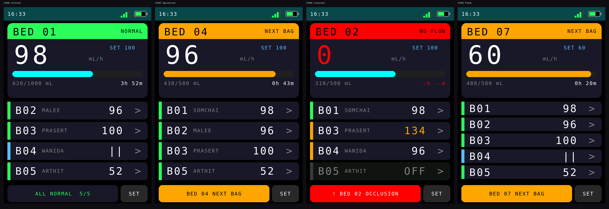
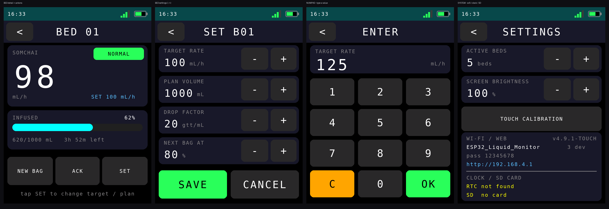
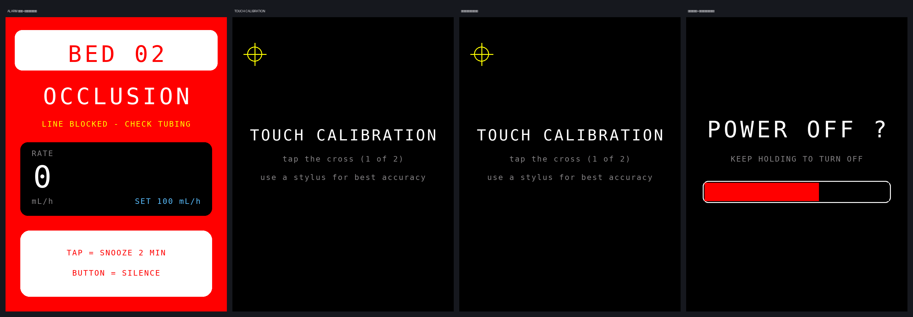

# Central Host Gateway v4.9.2-TOUCH — พอร์ตคุณสมบัติทั้งหมดจากรุ่นจอ OLED

ต่อยอดจาก `ESP32-S3-Host-Touch-V_4_9_0` โดยนำคุณสมบัติและการแก้บั๊กทั้งหมด
ที่ทำไว้ในรุ่นจอ OLED ตั้งแต่ v4.7.3 ถึง v4.7.5 มาใส่ให้ครบ
ส่วนที่รุ่นจอสัมผัสมีอยู่เดิมและรุ่น OLED ไม่มี (โมดูลนาฬิกา DS3231 และการบันทึกลง SD card)
ยังอยู่ครบทุกอย่าง ไม่ได้ตัดออก

**รุ่นเดิมยังไม่มีการแก้ไขเหล่านี้เลยแม้แต่ข้อเดียว** จึงยังมีอาการ Host ขึ้น OFFLINE
ทั้งที่เครื่องข้างเตียงทำงานปกติ ซึ่งเป็นปัญหาที่รายงานเข้ามา

## สิ่งที่พอร์ตมา

### 1. การส่ง Sync แบบไม่บล็อก (จาก v4.7.3)

ของเดิมส่งครบทุกเตียงในรอบเดียว โดยมี `delay(4)` คั่นทุกใบและ `delay(10)` เมื่อส่งไม่ผ่าน
แปดเตียงจึงทำให้ `loop()` หยุดนานได้ถึงราว **112 มิลลิวินาที** ระหว่างนั้น Host
รับข้อมูลจาก Station ไม่ได้เลย

ของใหม่แบ่งเป็น "ช่องเวลา" ส่งได้มากสุดหนึ่งใบต่อช่อง ไม่มี `delay()` ในลูปเลย
และมีคิวด่วน (`requestSyncNow`) สำหรับตอนค่าตั้งหรือรหัสเตือนเปลี่ยน

`ONLINE_TIMEOUT_MS` ขยายจาก 5 เป็น 8 วินาที ค่าเดิมสั้นเกินไปเมื่อมีหลายเตียง

### 2. การวัดคุณภาพลิงก์ (จาก v4.7.3)

วัดว่าได้รับแพ็กเก็ตจริงกี่เปอร์เซ็นต์ของที่ควรได้ใน 10 วินาทีล่าสุด
ต่างจาก RSSI ตรงที่ RSSI บอกว่าสัญญาณแรงแค่ไหน ส่วนค่านี้บอกว่าข้อมูลหายจริงหรือเปล่า
เตียงที่ RSSI ดีแต่ลิงก์ตก แปลว่าแพ็กเก็ตชนกัน ไม่ใช่สัญญาณอ่อน

### 3. ตรวจจับเลขเตียงซ้ำ (จาก v4.7.4)

เป็นสาเหตุที่พบบ่อยที่สุดของอาการ "เครื่องข้างเตียงขึ้น ONLINE แต่ Host ขึ้น OFFLINE"
Host แยกเตียงจากเลขที่เครื่องส่งมาเท่านั้น สองเครื่องที่ตั้งเลขซ้ำกันจะเขียนทับช่องเดียวกัน
จับได้จากการที่ MAC ต้นทางของเลขเตียงเดียวกันสลับไปมาถี่ผิดปกติ

พร้อมกันนี้ยังจำได้ว่าเคยได้ยินเลขเตียงใดบ้าง แม้เลขนั้นเกินจำนวนเตียงที่เปิดใช้
จึงบอกได้ว่า "ได้ยินเตียง 6 แต่ยังไม่ได้เปิดใช้"

### 4. รหัสเตือนใหม่ ALERT_NO_SIGNAL (จาก v4.7.4)

แยกกรณี "เชื่อมต่อได้และกำลังนับ แต่ไม่เคยจับหยดได้เลย" ออกจาก "สายพับ"
เพราะสายพับคือเคยไหลแล้วหยุด ส่วนอันนี้คือไม่เคยเริ่มเลย วิธีแก้คนละอย่าง

รหัสนี้ถูกแปลงเป็น `ALERT_NONE` ก่อนส่งให้ Station เสมอ เพื่อให้เข้ากันได้กับ
Station รุ่นเก่าที่ไม่รู้จักรหัสนี้

### 5. แอนิเมชันหยดน้ำเกลือ (จาก v4.7.5)

ไม่ได้เดาจังหวะเอง แต่ล็อกเฟสกับหยดจริงที่ Station วัดได้ โดยย้อนจาก `msSinceLastDrop`
รวมการแก้ของ v4.7.5 ที่เพดานคาบสั้นเกินไปจนวาด "หยดปลอม" คั่นระหว่างหยดจริงที่อัตราต่ำ

### 6. แก้บั๊ก oldPlan อ่านค่าหลังเขียนทับ (จาก v4.7.5)

รุ่นจอสัมผัสมีบั๊กเดียวกัน `oldPlan` ถูกประกาศใต้บล็อกที่เขียนค่าใหม่ไปแล้ว
จึงได้ค่าใหม่เสมอ เงื่อนไขเทียบเป็นเท็จตลอด ผลคือเปลี่ยนปริมาตรถุงอย่างเดียว
ไม่เคยล้าง `nearEndAck` ถุงใหม่จึงไม่เตือนใกล้หมดอีกเลยถ้าถุงเดิมเตือนไปแล้ว

## ส่วนแสดงผลที่เพิ่มบนจอสัมผัส

* **หน้ารายละเอียดเตียง** เพิ่มบรรทัดคุณภาพลิงก์และรหัสเครื่อง (MAC)
  ถ้าพบเลขเตียงซ้ำจะขึ้น `BED ID CLASH` เป็นสีแดง
* **หน้ารายละเอียดเตียง** เพิ่มกระเปาะหยดเคลื่อนไหวที่มุมขวาของการ์ดบน
  วาดทุกเฟรมแยกจากการแคชตัวเลข หยดจึงขยับจริง
* **แถบล่างหน้าหลัก** เพิ่มการแจ้งเลขเตียงซ้ำและเตียงที่ได้ยินแต่ยังไม่เปิดใช้
  จัดให้มาก่อนการเตือนใกล้หมด เพราะเลขเตียงซ้ำทำให้เตียงที่เหลือไม่ถูกเฝ้าเลย

## หน้าเว็บ

* เพิ่มแถวคุณภาพลิงก์และรหัสเครื่องบนการ์ดทุกเตียง
* เพิ่มคำเตือนเลขเตียงซ้ำบนการ์ด
* เพิ่มแถบวินิจฉัยที่อธิบายสาเหตุและบอกวิธีแก้ ครอบคลุมสามกรณี
  คือเลขเตียงซ้ำ เลขเตียงเกินจำนวนที่เปิดใช้ และยังไม่ได้รับข้อมูลจากบางเตียง
* เพิ่มรหัสเตือน "เซนเซอร์ยังไม่จับหยด"
* API `/api/data` ส่งค่าเพิ่ม `link` `mac` `idConflict` `heardBeyond` `linkWeakPct`
  `rxTotal` และ `syncFail` โดยยังคงส่ง `rtc` `sd` และ `sdRows` ของรุ่นนี้ไว้ตามเดิม

## ผลตรวจบนเครื่อง PC

| ชุดตรวจ | ผล |
|---|---|
| `check-ino-types` | ผ่าน 20 จาก 20 ไฟล์ |
| `touch-preview` | คอมไพล์ผ่านและเรนเดอร์ครบ 12 หน้า |
| `host-rx-test` | **ผ่าน 7 จาก 7 ข้อ** รวมการตรวจจับเลขเตียงซ้ำและเลขเกินจำนวน |
| `protocol-test` | โครงสร้างแพ็กเก็ตตรงกันทุกเฟิร์มแวร์ |
| `dashboard-preview` | หน้าเว็บแสดงลิงก์ MAC และคำเตือนครบ |

**โครงสร้างแพ็กเก็ต Protocol v3 ไม่เปลี่ยนแม้แต่ไบต์เดียว** ใช้คู่กับ Station
ทุกรุ่นตั้งแต่ 7.4.x ขึ้นไปได้ตามเดิม

## หมายเหตุเรื่องหมายเลขรุ่น

โฟลเดอร์เดิมชื่อ `V_4_9_0` แต่ `APP_VERSION` ในโค้ดเขียนว่า `4.9.1-TOUCH` ซึ่งไม่ตรงกัน
รุ่นนี้จึงข้ามไปใช้ `4.9.2` ทั้งชื่อโฟลเดอร์และในโค้ด เพื่อไม่ให้กำกวม

## ยังไม่ได้ทำ

* **ยังไม่ได้ทดสอบบนฮาร์ดแวร์จริง** ทุกอย่างตรวจด้วยเครื่องมือจำลองบนเครื่อง PC เท่านั้น
* หน้าเว็บของรุ่นนี้ยังไม่มีแถบแจ้งเตือนรวมสีแดงและสีส้มแบบรุ่น OLED
  (มีเฉพาะแถบวินิจฉัย) เพราะโครงหน้าเว็บสองรุ่นต่างกันในส่วนนั้น

---

## เอกสารเดิมจากรุ่นก่อนหน้า

ต่อยอดจาก `ESP32-S3-Host-TFT-V_4_8_0` โดยเปลี่ยนเป็น **จอสัมผัส 2.4" แนวตั้ง 240x320**
(ST7789V หรือ ILI9341 + ทัชแบบความต้านทาน XPT2046) และทำหน้าจอให้ใช้งานด้วยการแตะ
ตรรกะการวัด การแจ้งเตือน ESP-NOW (Protocol v3) และหน้าเว็บทั้งหมดเหมือนเดิมทุกประการ
ใช้คู่กับ **Station v7.4.x / v7.5.x** ได้ทันที

**เพิ่มใน v4.9.1** — นาฬิกา **DS3231** เก็บวันที่-เวลาไว้แม้ถอดไฟ (ตั้งเวลาครั้งแรกจากสมาร์ตโฟน
ผ่านหน้าเว็บ แล้วเขียนลงชิปนาฬิกาให้เอง) และ **บันทึกข้อมูลลงการ์ด SD** ที่ช่องด้านหลังจอ
เป็นไฟล์ CSV รายวัน ดาวน์โหลดจากหน้าเว็บได้โดยไม่ต้องถอดการ์ด

## การต่อสาย

โมดูล 2.4" มีขาสองชุด: ชุดจอ 14 ขา และชุดทัช 4-5 ขา ใช้บัส SPI ร่วมกัน

| ขาบนโมดูล | ขา ESP32-S3 | หมายเหตุ |
|---|---|---|
| VCC / GND | 3V3 / GND | |
| SCL / SCK | **GPIO 12** | `TFT_SCLK` (ทัชใช้ขานี้ร่วมกัน) |
| SDA / MOSI | **GPIO 11** | `TFT_MOSI` (ทัชใช้ขานี้ร่วมกัน) |
| RES | **GPIO 8** | `TFT_RST` |
| DC | **GPIO 9** | `TFT_DC` |
| CS | **GPIO 10** | `TFT_CS` |
| BLK | **GPIO 13** | `TFT_BLK` — ควบคุมความสว่างด้วย PWM (ตั้ง `-1` ถ้าต่อ 3V3 ตลอด) |
| T_DO (MISO) | **GPIO 16** | `TFT_MISO` — จำเป็นสำหรับอ่านค่าทัช |
| T_CS | **GPIO 14** | `TOUCH_CS_PIN` |
| T_IRQ | **GPIO 15** | `TOUCH_IRQ_PIN` (ตั้ง `255` ถ้าไม่ได้ต่อ) |
| ปุ่ม multifunction | **GPIO 4** | ต่อลงกราวด์ (ขาเดิมของปุ่ม POWER) |
| SD_CS | **GPIO 21** | `SD_CS_PIN` — ช่อง SD ด้านหลังจอ |
| SD_MOSI / SD_SCK / SD_MISO | **GPIO 11 / 12 / 16** | ต่อร่วมบัสเดียวกับจอและทัชได้เลย |
| DS3231 SDA | **GPIO 5** | `RTC_SDA_PIN` |
| DS3231 SCL | **GPIO 6** | `RTC_SCL_PIN` |

* ห้ามใช้ GPIO 33-37 บนบอร์ด N16R8 เพราะถูกใช้กับ PSRAM
* ไลบรารีที่ต้องติดตั้ง: `Adafruit GFX`, `Adafruit ST7735/ST7789`, `XPT2046_Touchscreen` (PaulStoffregen),
  `RTClib` (Adafruit) — ส่วน `SD`, `FS`, `Wire` มากับแกน ESP32 อยู่แล้ว
* โมดูล DS3231 ใส่ถ่าน CR2032 (หรือ LIR2032) ไว้ด้วย เวลาจึงจะไม่หายเมื่อดับเครื่อง
* การ์ด SD ฟอร์แมตเป็น **FAT32** (แนะนำ 4–32 GB) เสียบก่อนเปิดเครื่องหรือเสียบทีหลังก็ได้
  ระบบจะลองต่อการ์ดใหม่ให้เองทุก 30 วินาที
* ถ้าโมดูลของคุณเป็นชิป **ILI9341** ให้เปลี่ยนไปใช้ `Adafruit_ILI9341` แทน 2 บรรทัด
  (`#include` และการประกาศ `tft`) ส่วนที่เหลือใช้ได้เหมือนกัน
* ถ้าภาพกลับหัวให้เปลี่ยน `TFT_ROTATION` จาก 0 เป็น 2
* ถ้าแตะแล้วตำแหน่งสลับแกน/กลับด้าน ให้แก้ `TOUCH_SWAP_XY`, `TOUCH_FLIP_X`, `TOUCH_FLIP_Y`

## การใช้งานหน้าจอ

| หน้า | การใช้งาน |
|---|---|
| **HOME** | เตียงที่ต้องดูตอนนี้อยู่บนสุด (เลือกอัตโนมัติ: เหตุวิกฤต → ใกล้หมดถุง) ด้านล่างเป็นรายการเตียงอื่น **แตะที่ใดก็ได้เพื่อเข้าดูเตียงนั้น** มุมขวาล่างมีปุ่ม `SET` เข้าหน้าตั้งค่าระบบ |
| **BED** | รายละเอียดเตียง + ปุ่มสั่งงาน 3 ปุ่ม: `NEW BAG` (เริ่มถุงใหม่ รีเซ็ตตัวนับที่เตียง), `ACK` (รับทราบเตือนใกล้หมด), `SET` (ตั้งค่าของเตียง) |
| **BED SETTINGS** | อัตราเป้าหมาย, ปริมาตรตามแผน, Drop factor, % เตือนใกล้หมด — กด `-` `+` หรือ **แตะที่ตัวเลขเพื่อพิมพ์เอง** แล้วกด `SAVE` |
| **NUMPAD** | แป้นตัวเลขบนจอ (C = ล้าง, OK = ยืนยัน) |
| **SYSTEM** | จำนวนเตียงที่ใช้งาน, ความสว่างหน้าจอ, ปรับความแม่นจอสัมผัส, ข้อมูล Wi-Fi/เว็บ และสถานะนาฬิกา DS3231 / การ์ด SD |
| **ALARM** | ขึ้นเองเมื่อมีเหตุวิกฤต **แตะที่ไหนก็ได้ = พักเสียง 2 นาที** |

ค่าที่ตั้งจากหน้าจอกับที่ตั้งจากหน้าเว็บเป็นชุดเดียวกัน (บันทึกลง NVS และส่งให้เครื่องประจำเตียงทันที)

## ปุ่ม multifunction 1 ปุ่ม

| การกด | ผลลัพธ์ |
|---|---|
| คลิก 1 ครั้ง | มีเสียงเตือน = พักเสียง 2 นาที / มีเตือนใกล้หมด = รับทราบทุกเตียง / จอดับ = ปลุกจอ / อยู่หน้าย่อย = ย้อนกลับ |
| ดับเบิลคลิก | ปิด/เปิดหน้าจอ (ระบบยังทำงานและยังเตือนตามปกติ) |
| กดค้าง 2 วินาที | ปิดเครื่อง (กดค้าง 2 วินาทีอีกครั้งเพื่อเปิด) |

หน้าจอจะหรี่ลงอัตโนมัติเมื่อไม่มีการใช้งาน 3 นาที และกลับมาสว่างเมื่อแตะจอหรือกดปุ่ม
(ไม่หรี่ขณะมีเหตุเตือนหรือเตือนใกล้หมดที่ยังไม่รับทราบ)

## การปรับความแม่นของจอสัมผัส

เปิดเครื่องครั้งแรกจะเข้าหน้าปรับอัตโนมัติ — แตะกากบาท 2 จุดตามที่ปรากฏ (ใช้สไตลัสจะแม่นที่สุด)
ค่าที่ได้เก็บไว้ใน NVS และปรับใหม่ได้ทุกเมื่อจากหน้า SYSTEM

## นาฬิกา DS3231 (วันที่-เวลา)

เครื่องนี้ไม่ต่ออินเทอร์เน็ต จึงไม่มี NTP ลำดับการหาเวลาเป็นดังนี้

1. เปิดเครื่อง → อ่านเวลาจาก **DS3231** (ถ้าโมดูลมีเวลาที่ใช้ได้ ถือว่าเวลาถูกต้องทันที)
2. ถ้าไม่มีโมดูลหรือถ่านหมด → ใช้เวลาสำรองที่เก็บไว้ใน NVS (ขึ้นว่า "เวลาโดยประมาณ")
3. เปิดหน้าเว็บจากสมาร์ตโฟน/แท็บเล็ต → หน้าเว็บส่งเวลาของเครื่องนั้นให้ Host อัตโนมัติ
   (`POST /api/time/set`) แล้ว Host **เขียนเวลานั้นลง DS3231 ให้ด้วย** ตั้งครั้งเดียวก็อยู่ยาว
4. ระหว่างใช้งาน Host เทียบเวลากับ DS3231 ทุก 1 ชั่วโมง ถ้าคลาดเกิน 2 วินาทีจะปรับตาม

## การบันทึกลงการ์ด SD

ไฟล์ทั้งหมดอยู่ในโฟลเดอร์ `/IVLOG` ตั้งชื่อตามวัน (เช่น `20260916_data.csv`) ขึ้นไฟล์ใหม่ทุกวัน

| ไฟล์ | เขียนเมื่อไร | คอลัมน์ |
|---|---|---|
| `YYYYMMDD_data.csv` | ทุก 1 นาที ทุกเตียงที่ใช้งาน | `datetime, minute, bed, patient, drops, volume_ml, rate_mlhr, target_mlhr, alert, rssi, battery_v` |
| `YYYYMMDD_event.csv` | เมื่อมีเหตุการณ์ | `datetime, type, bed, detail` |

ชนิดเหตุการณ์ที่บันทึก: `BOOT`, `TIME_SET`, `NEW_BAG`, `ACK_NEAR_END`, `BED_CONFIG`,
`ALERT` (เริ่มมีเหตุเตือน) และ `ALERT_CLEAR` (กลับสู่ปกติ)

ดูและดาวน์โหลดไฟล์ได้จากหน้าเว็บ แท็บ **Log & Shift Report** → การ์ด "ไฟล์บันทึกบนการ์ด SD"
(ใช้ `GET /api/sd/list` และ `GET /api/sd/download?file=...` — เปิดเฉพาะไฟล์ในโฟลเดอร์ `/IVLOG`)
สถานะการ์ดและจำนวนแถวที่บันทึกแล้วขึ้นที่แถบสถานะด้านบนของหน้าเว็บและที่หน้า SYSTEM บนจอ

## หมายเหตุสำหรับการพัฒนาต่อ

* ทัชเป็นแบบความต้านทาน อ่านทีละจุด ไม่มี multi-touch จึงใช้เฉพาะ "แตะ" ไม่มีการปัดหรือซูม
  โค้ดอ่านค่าแบบ 1 เหตุการณ์ต่อการแตะ 1 ครั้ง พร้อมตัวกันแตะรัว 180 ms และเกณฑ์แรงกดขั้นต่ำ
* ทุกหน้าจอวาดเฉพาะส่วนที่ค่าเปลี่ยน และตอบสนองการแตะทันที (ไม่รอรอบวาดถัดไป)
* ฟอนต์มาตรฐานของ Adafruit GFX ไม่มีตัวอักษรไทย ชื่อผู้ป่วยบนจอจึงแสดงได้เฉพาะอักษรโรมัน
  (ตั้งชื่อจากหน้าเว็บได้ตามปกติ) — เวอร์ชันนี้ไม่มีแป้นพิมพ์ตัวอักษรบนจอตามที่ตกลงไว้
* ดูภาพทุกหน้าจอโดยไม่ต้องแฟลชลงบอร์ดได้ที่ `tools/touch-preview/run.sh`
* การ์ด SD ใช้บัส SPI ร่วมกับจอ จึงตั้งความเร็วไว้ 20 MHz (`SD_SPI_HZ`) ถ้าเจออาการภาพกระพริบ
  หรือเขียนไฟล์ไม่สำเร็จ ให้ลดลงเหลือ 10 MHz
* **ยังไม่ได้ทดสอบบนฮาร์ดแวร์จริง** สิ่งที่ควรตรวจก่อนใช้งาน: ทิศทางจอและทิศทางทัช,
  ความเร็ว SPI 40 MHz กับสายที่ใช้ (ลดเป็น 27 MHz ถ้าภาพรบกวน), เกณฑ์แรงกด `TOUCH_MIN_PRESSURE`,
  การอ่าน/เขียนการ์ด SD ร่วมบัสกับจอ และที่อยู่ I2C ของ DS3231 (0x68)
