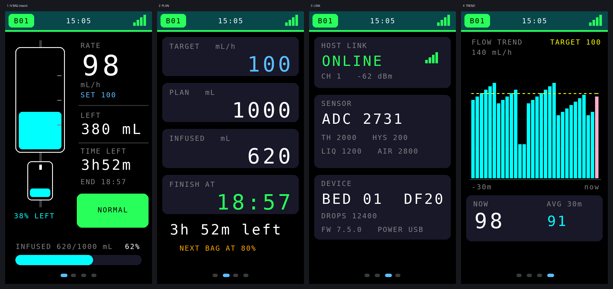
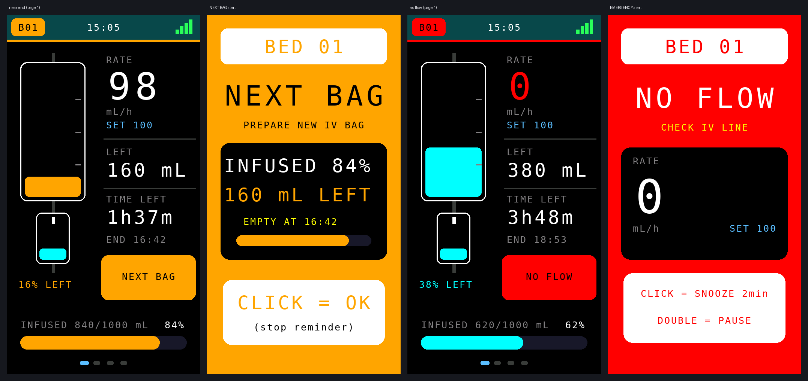
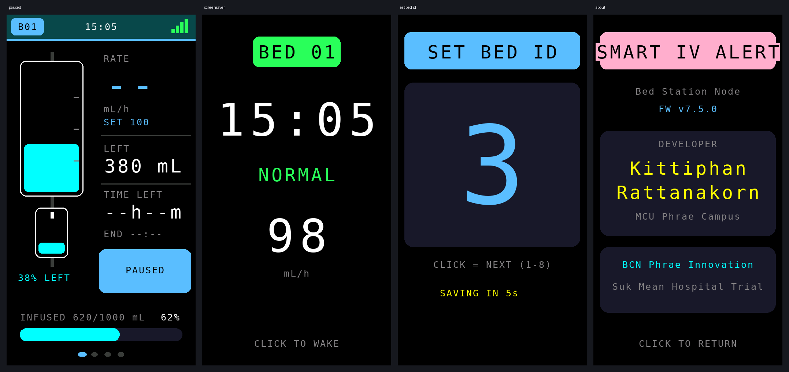

# Bed Station Node v7.5.0 — ออกแบบหน้าจอ TFT ใหม่ (แนวทาง IV BAG)

ดัดแปลงจาก `ESP32-S3-Station-V_7_4_0.ino` โดย **เปลี่ยนเฉพาะส่วนแสดงผล**
ตรรกะการนับหยด การคำนวณอัตราไหล การแจ้งเตือน การสื่อสาร ESP-NOW และ Protocol v3
เหมือนเดิมทุกไบต์ จึงใช้คู่กับ **Host v4.6.0 หรือ v4.7.0** ได้ทันที

## แนวคิดการออกแบบ

* **ข้อความเท่าที่จำเป็น** — หน้าหลักมีข้อความเพียง 10 ชิ้น (เดิม 18 ชิ้น) ที่เหลือใช้ภาพและสีแทน
* **เห็นสถานะก่อนอ่านตัวเลข** — แถบสีที่ขอบบนและป้ายหมายเลขเตียงเปลี่ยนสีตามภาวะของเตียง
  (เขียว = ปกติ, เหลือง = ช้าไป, ส้ม = เร็วไป/ใกล้หมดถุง, แดง = ไม่มีการไหล, ฟ้า = พักการนับ)
* **ภาพแทนคำอธิบาย** — ถุงน้ำเกลือบนจอมีระดับน้ำลดลงจริงตามปริมาณที่ให้ไปแล้ว
  และกระเปาะหยดมีภาพหยดตกตามหยดจริงที่เซนเซอร์นับได้
* **ตัวเลขใหญ่พอมองจากปลายเตียง** — ค่าที่ต้องดูบ่อยใช้ขนาด 2-4 เท่าของตัวอักษรพื้นฐาน

## 4 หน้าจอ (คลิก 1 ครั้งเพื่อเปลี่ยนหน้า)

| หน้า | เนื้อหา |
|---|---|
| **1 IV BAG** | ถุงน้ำเกลือ + กระเปาะหยด + อัตราไหลปัจจุบัน / ปริมาณคงเหลือ / เวลาที่เหลือ / เวลาที่จะหมด + แถบความคืบหน้า |
| **2 PLAN** | อัตราเป้าหมาย, ปริมาณตามแผน, ให้ไปแล้ว, เวลาที่จะหมด (การ์ดตัวเลขใหญ่ 4 ใบ) + จุดเตือนเตรียมถุงใหม่ |
| **3 LINK** | สถานะเชื่อมต่อ Host (ONLINE/NO LINK, ช่อง, ความแรงสัญญาณ), ค่าเซนเซอร์สด, ข้อมูลเครื่อง |
| **4 TREND** | กราฟแท่งอัตราไหลย้อนหลัง 30 นาที (แท่งละ 1 นาที) พร้อมเส้นประสีเหลืองของอัตราเป้าหมาย |

หน้า TREND ช่วยให้เห็นว่าการไหล "สม่ำเสมอ" หรือ "ตกเป็นช่วง ๆ" โดยไม่ต้องเปิดหน้าเว็บของ Host
แท่งสีชมพูขวาสุดคือนาทีที่กำลังวัดอยู่ ขีดแดงที่ฐานคือช่วงที่ไม่มีการไหลเลย

## จอแจ้งเตือน

* **EMERGENCY (แดง)** — สายพับ/ไม่มีการไหล, เร็วเกิน, ช้าเกิน, ให้ครบตามแผน
  คลิก = พักเสียง 2 นาที, ดับเบิลคลิก = หยุด/เริ่มนับ (เช่น ตอนเปลี่ยนถุง)
* **NEXT BAG (ส้ม)** — ให้ไปแล้วถึง % ที่ตั้งจากหน้าเว็บ คลิก = รับทราบ (หยุดเตือนซ้ำ)
  ไม่ใช่เหตุวิกฤต จึงไม่เข้าจอแดงและไม่มีเสียงดังต่อเนื่อง

## ปุ่มกด (เหมือน v7.4.0 ทุกประการ ยกเว้นจำนวนหน้า)

| การกด | ผลลัพธ์ |
|---|---|
| คลิก 1 ครั้ง | เปลี่ยนหน้า 1 → 2 → 3 → 4 (ในจอเตือน = พักเสียง 2 นาที / รับทราบ) |
| ดับเบิลคลิก | หยุด/เริ่มนับหยด |
| คลิก 3 ครั้ง | ตั้งหมายเลขเตียง 1-8 |
| กดค้าง 3 วินาที | Calibration Wizard |
| กดค้าง 5 วินาที | หน้าข้อมูลเครื่อง/ผู้พัฒนา |

## ภาพหน้าจออื่น ๆ

## หมายเหตุสำหรับการพัฒนาต่อ

* ฟอนต์มาตรฐานของ Adafruit GFX ไม่มีตัวอักษรไทย ข้อความบนจอจึงเป็นคำอังกฤษสั้น ๆ ตามที่ตกลงไว้
  หากต้องการภาษาไทยในอนาคต ต้องฝังฟอนต์บิตแมปไทย (แปลงเป็น GFXfont) เพิ่มประมาณ 20-40 KB
* ทุกหน้าวาดเฉพาะส่วนที่ค่าเปลี่ยน (มีตัวแปรแคชกำกับทุกชิ้น) และกราฟวาดใหม่เฉพาะแท่งล่าสุด
  เพื่อไม่ให้ SPI แย่งเวลาการอ่าน ADC จนพลาดการนับหยด
* ดูหน้าจอทุกหน้าโดยไม่ต้องแฟลชลงบอร์ดได้ที่ `tools/station-preview/run.sh`
