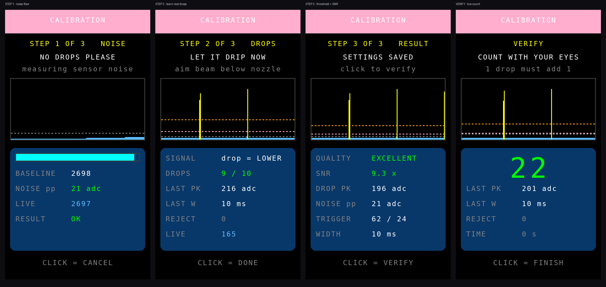

# Bed Station Node v7.5.1 — ระบบคัดกรองหยดและหน้าคาลิเบรตใหม่

ต่อยอดจาก `ESP32-S3-Station-V_7_5_0` โดย **เปลี่ยนเฉพาะวิธีตรวจจับหยดและหน้าคาลิเบรต**
หน้าจอทั้ง 4 หน้า การสื่อสาร ESP-NOW (Protocol v3) และการแจ้งเตือนเหมือนเดิมทุกไบต์
ใช้คู่กับ **Host v4.6.0 / v4.7.0 / v4.8.0 / v4.9.x** ได้ทันที และใช้ผังขาเดิม (เซนเซอร์ที่ GPIO 4)

คำอธิบายการออกแบบหน้าจอทั้ง 4 หน้าและจอแจ้งเตือน อยู่ใน
[README ของ v7.5.0](../ESP32-S3-Station-V_7_5_0/README.md) ซึ่งยังใช้ได้ทั้งหมด

## ปัญหาที่แก้ และสาเหตุจริง

### 1. อ่านเบิ้ล — เป็นบั๊กในตัวกันสัญญาณรัว ไม่ใช่เรื่องเซนเซอร์

โค้ดเดิมใน `checkAnalogDrop()` เป็นแบบนี้

```c
if (!dropState && (sensorValue < dropThreshold)) {
  if (now - lastDebounceTime > minDropInterval) {   // 55 ms
    dropState = true;  totalDrops++;  lastDebounceTime = now;
  }
}
else if (dropState && (sensorValue > dropThreshold + hysteresis)) dropState = false;
```

เมื่อค่าต่ำกว่าเกณฑ์ **แต่ยังไม่พ้น 55 ms** โปรแกรมจะไม่นับ — และก็ **ไม่ตั้ง `dropState`** ด้วย
ตัวจับจึงยัง "ง้าง" ค้างอยู่ พอครบ 55 ms ขณะที่สัญญาณยังต่ำอยู่ ก็นับซ้ำจากหยดเดิมทันที
ถ้าสัญญาณค้างต่ำอยู่ 170 ms ก็จะนับ 3 ครั้งจากหยดเดียว นี่คืออาการ "เหมือนกดสวิตช์แล้วลั่น"
ที่พบ และยิ่งเกณฑ์อยู่ใกล้ระดับปกติเท่าไร อาการยิ่งบ่อยขึ้น

**วิธีแก้:** นับตอน **"พัลส์จบ"** ที่จุดเดียวในโค้ด แล้วบังคับให้สัญญาณกลับมานิ่งใต้เกณฑ์ปลด
ต่อเนื่อง 20 ms ก่อนจึงจะรับพัลส์ถัดไปได้ โครงสร้างนี้ทำให้ **1 พัลส์ = 1 หยด เสมอ**
ไม่ว่าพัลส์จะยาวแค่ไหนหรือสัญญาณจะสั่นกี่ครั้งระหว่างทาง

### 2. หาช่วงต่างยาก — เพราะของเดิมวัดผิดสิ่ง

Wizard เดิมให้วัดค่านิ่ง 2 ค่า คือ "กระเปาะมีสารน้ำ" กับ "กระเปาะเปล่า" แล้วตั้งเกณฑ์ที่กึ่งกลาง

แต่สิ่งที่ต้องตรวจจับจริง ๆ คือ **หยดที่ตกผ่านลำแสงในเวลาราว 10 ms** ซึ่งบังลำแสงเพียงบางส่วน
สัญญาณจึงเบนจากค่าปกติแค่เศษเสี้ยวของระยะ "มีน้ำ ↔ เปล่า" เกณฑ์กึ่งกลางจึงสูงเกินไปจนจับไม่ได้
ต้องไปขยับเซนเซอร์จนสัญญาณเฉียดเกณฑ์พอดี ซึ่งก็คือจุดที่ไม่เสถียรที่สุด — จับได้บ้างไม่ได้บ้าง
และเบิ้ลตามข้อ 1

**วิธีแก้:** เลิกใช้ค่า ADC สัมบูรณ์ หันมาวัด **"ระยะเบนจากเส้นฐาน" (delta)** โดยเส้นฐาน
ไล่ตามค่าปกติเองตลอดเวลา และเกณฑ์มาจากการวัดหยดจริงในขั้นตอนคาลิเบรต

## สายสัญญาณใหม่

```
ADC 2 kHz ─► มีเดียน 5 จุด ─► เส้นฐานปรับอัตโนมัติ ─► delta ─► ชมิตต์ทริกเกอร์ ─► กรองความกว้าง ─► นับ
```

| ส่วน | ทำอะไร | แก้ปัญหาอะไร |
|---|---|---|
| อ่านที่คาบคงที่ 2 kHz | พัลส์กว้าง 10 ms ได้ตัวอย่างราว 20 จุด | เดิมอ่านรอบละครั้งตามจังหวะ loop ซึ่งไม่สม่ำเสมอ |
| มีเดียน 5 จุด | ตัดสไปก์เดี่ยว | ADC ของ ESP32 กระโดดแรงตอน Wi-Fi/ESP-NOW ส่งข้อมูล |
| เส้นฐานปรับอัตโนมัติ (~0.5 วินาที) | ตามการดริฟต์ของอุณหภูมิ แสงรอบข้าง แรงดันไฟ | ไม่ต้องคาลิเบรตใหม่เมื่อสภาพแวดล้อมเปลี่ยน |
| หยุดเส้นฐานระหว่างมีพัลส์ | เส้นฐานไม่ไล่ตามหยดจนกลืนหายไป | หยดยาวไม่ถูกมองข้าม |
| ชมิตต์ทริกเกอร์ (เข้า/ออกคนละระดับ) | เกณฑ์ปลด = 40% ของเกณฑ์เข้า | สัญญาณสั่นรอบเกณฑ์ไม่ทำให้นับซ้ำ |
| กรองความกว้าง 2-150 ms | แคบไป = สัญญาณรบกวน, กว้างไป = ไม่ใช่หยด | กันทั้งสไปก์และการที่ระดับน้ำ/สิ่งบังลำแสงเปลี่ยน |
| นับตอนพัลส์จบ + รอนิ่ง 20 ms | 1 พัลส์ = 1 หยด | **แก้อาการอ่านเบิ้ลโดยตรง** |
| รู้ทิศสัญญาณเอง | หยดทำให้ค่าลดลงหรือเพิ่มขึ้นก็ได้ | ติดตั้งเซนเซอร์กลับด้านก็ยังใช้ได้ |
| ตั้งต้นใหม่เมื่ออ่านขาดช่วง > 25 ms | ไม่เดาพัลส์ที่มองเห็นไม่ครบ | ตอนวาดจอทั้งหน้าจะไม่เกิดหยดผี |

## หน้าคาลิเบรตใหม่ (กดปุ่มค้าง 3 วินาที)



ทุกหน้ามี **จอคลื่นสด** อยู่ด้านบน แสดง delta ย้อนหลังราว 2.5 วินาที
เส้นประส้ม = เกณฑ์เข้า, เส้นประชมพู = เกณฑ์ปลด, เส้นประเทา = ระดับสัญญาณรบกวน
แท่งสีฟ้า = ช่วงว่าง, แท่งสีเหลือง = ช่วงที่เกินเกณฑ์ (คือหยด) — **เห็นด้วยตาทันทีว่าอันไหนคืออะไร**

### ขั้นที่ 1 — NOISE (3 วินาที, ห้ามมีหยด)

วัด **พื้นสัญญาณรบกวน** ของเซนเซอร์ตัวนี้ในตำแหน่งติดตั้งจริง นี่คือขีดล่างของฮาร์ดแวร์:
สัญญาณของหยดที่เล็กกว่านี้ ไม่มีอัลกอริทึมใดแยกออกได้

| NOISE pp | หมายความว่า |
|---|---|
| ≤ 20 | VERY QUIET — ดีมาก |
| 21-60 | OK — ใช้งานได้สบาย |
| 61-150 | NOISY — ควรหาทางลดก่อน (ดูหัวข้อฮาร์ดแวร์ด้านล่าง) |
| > 150 | VERY NOISY — ต้องแก้ก่อน ไม่งั้นจะนับพลาดแน่ |

### ขั้นที่ 2 — DROPS (ให้น้ำหยดจริง 10 หยด)

ใช้เกณฑ์ไวชั่วคราว (4 เท่าของสัญญาณรบกวน) จับพัลส์จริง แล้วเก็บ **ความสูง** และ **ความกว้าง**
ของแต่ละหยด พร้อมเดาทิศสัญญาณให้เอง หน้าจอแสดงสด ๆ ว่าตอนนี้เก็บได้กี่หยด
พัลส์ล่าสุดสูงเท่าไร กว้างกี่มิลลิวินาที และมีพัลส์ที่ถูกคัดทิ้งกี่ครั้ง

### ขั้นที่ 3 — RESULT (คำนวณและบันทึก)

ตั้งเกณฑ์ที่ **จุดกึ่งกลางระหว่างสองข้อจำกัด**

```
ขอบล่าง = 3 × สัญญาณรบกวนยอดถึงยอด      (ต้องพ้นสัญญาณรบกวนให้ขาด)
ขอบบน   = 55% ของหยดที่จางที่สุด          (ต้องต่ำพอที่หยดจางสุดยังผ่าน)
เกณฑ์เข้า = (ขอบล่าง + ขอบบน) / 2
เกณฑ์ปลด = 40% ของเกณฑ์เข้า
```

แล้วรายงาน **SNR = ความสูงหยดกลาง ÷ สัญญาณรบกวน** ซึ่งเป็นตัวเลขที่บอกตรง ๆ ว่า
ตำแหน่งติดตั้งนี้ดีพอหรือยัง

| SNR | คำตัดสิน | ควรทำอะไร |
|---|---|---|
| ≥ 8.0 | EXCELLENT | ใช้ได้เลย |
| 5.0-7.9 | GOOD | ใช้ได้ |
| 3.0-4.9 | FAIR | พอใช้ แต่ถ้าขยับเซนเซอร์ได้จะดีกว่านี้ |
| 2.0-2.9 | POOR | จะมีพลาดบ้าง ควรแก้ตำแหน่ง |
| < 2.0 | TOO WEAK | ยังไม่ควรใช้ ต้องแก้ฮาร์ดแวร์ก่อน |

ถ้าความสูงของหยดแต่ละหยดต่างกันเกิน 80% จะขึ้นเตือน `UNEVEN - ALIGN SENSOR`
แปลว่าหยดบางหยดผ่านขอบลำแสงแทนที่จะผ่านกลางลำแสง

### ขั้นตรวจสอบ — VERIFY (20 วินาที)

นับหยดสดด้วยค่าที่เพิ่งได้ ให้นับด้วยตาเทียบกับตัวเลขบนจอ **หยด 1 หยดต้องขึ้น 1 พอดี**
ถ้าขึ้นทีละ 2 แสดงว่ายังมีอะไรผิด (ดูช่อง REJECT และรูปคลื่นประกอบ)

กดปุ่มระหว่างขั้นที่ 1 หรือ 2 = ยกเลิก **โดยไม่เขียนทับค่าเดิมที่ใช้งานได้อยู่**

## ดูค่าสดได้จากหน้า 3 LINK

การ์ด SENSOR เปลี่ยนจาก `ADC / TH / HYS` มาแสดง

* `D <ตัวเลข>` — ระยะเบนจากเส้นฐานตอนนี้ ปกติจะแกว่งใกล้ 0 และพุ่งขึ้นตอนมีหยด
  (ตัวเลขเปลี่ยนเป็นสีเหลืองขณะที่พัลส์กำลังดำเนินอยู่)
* `TRIG / NOISE` — เกณฑ์ที่ใช้อยู่ และสัญญาณรบกวนที่วัดได้สด ๆ
* `SNR x.x <คำตัดสิน>` หรือ `NOT CALIBRATED`

## ทำให้เซนเซอร์อินฟราเรดดีที่สุดเท่าที่ทำได้

อัลกอริทึมช่วยได้ถึงขีดหนึ่ง ที่เหลือเป็นเรื่องฮาร์ดแวร์ เรียงตามผลที่ได้จริง

1. **ตำแหน่งลำแสง** — เล็งให้ลำแสงตัดผ่านทางที่หยดตก **ต่ำกว่าปลายหัวหยดราว 3-5 มม.**
   ตรงนั้นหยดยังเป็นก้อนกลมและเคลื่อนที่เร็ว สัญญาณจึงคมและสูง
   ถ้าเล็งต่ำเกินไปหยดจะยืดตัวและอาจแตก ทำให้ได้พัลส์เตี้ยและอาจมี 2 ลูกติดกัน
   **อย่าเล็งไปที่ผิวน้ำด้านล่างของกระเปาะ** เพราะระดับน้ำเปลี่ยนช้า ๆ ไม่ใช่พัลส์
2. **ให้ลำแสงผ่านกลางทางหยด** ไม่ใช่ขอบ — ถ้าความสูงพัลส์แต่ละหยดต่างกันมาก (ขึ้น
   `UNEVEN`) แปลว่ายังไม่ตรงกลาง
3. **บังแสงรอบข้าง** — แสงแดดและหลอด LED บางรุ่นมีอินฟราเรดปนมาก ครอบกระเปาะด้วยปลอกทึบ
   จะลด NOISE pp ได้มากที่สุดในบรรดาวิธีทั้งหมด
4. **กรองไฟเลี้ยงเซนเซอร์** — ใส่ 100 nF ขนานกับ 10 µF ที่ขา VCC-GND ของโมดูล ให้ชิดตัวโมดูล
   ADC ของ ESP32 จะกระโดดตามจังหวะที่ Wi-Fi ส่งข้อมูล การกรองไฟช่วยได้ชัดเจน
5. **กรองสาย AO** — ใส่ตัวเก็บประจุ 1-10 nF จากขา AO ลงกราวด์ที่ฝั่ง ESP32
   ช่วยกัดความถี่สูงออกก่อนเข้า ADC (มีเดียน 5 จุดในเฟิร์มแวร์ช่วยอีกชั้น)
6. **สายสั้นและบิดเกลียว** — สาย AO ที่ยาวและเดินคู่กับสายจอ SPI จะรับสัญญาณรบกวนเข้ามา
7. **ความสะอาดของกระเปาะ** — คราบและฟองเกาะผนังทำให้ความสูงพัลส์ไม่สม่ำเสมอ

ทำข้อ 1-3 ก่อนเสมอ แล้วกดคาลิเบรตใหม่ดู SNR ว่าขยับขึ้นไหม — หน้าคาลิเบรตออกแบบมา
ให้ใช้เป็นเครื่องมือวัดตอนจัดตำแหน่งได้โดยตรง

## ค่าที่ปรับได้ตอนต้นไฟล์

| `#define` | ค่าเริ่มต้น | ปรับเมื่อ |
|---|---|---|
| `SENSOR_SAMPLE_US` | 500 | อยากอ่านถี่/ห่างกว่านี้ (500 = 2 kHz) |
| `SENSOR_MEDIAN_N` | 5 | สัญญาณรบกวนเป็นสไปก์แหลมมาก ลองเพิ่มเป็น 7 |
| `BASELINE_STEP_DIV` | 1024 | เส้นฐานไล่ตามเร็ว/ช้าไป (มาก = ช้า) |
| `DROP_MIN_WIDTH_MS` | 2 | ยังมีสไปก์เล็ดลอด ลองเพิ่มเป็น 3-4 |
| `DROP_MAX_WIDTH_MS` | 150 | หยดช้ามากจนพัลส์กว้างกว่านี้ |
| `DROP_REARM_MS` | 20 | ยังเบิ้ลอยู่ (แทบไม่ควรต้องปรับแล้ว) เพิ่มเป็น 30-40 |

`minDropInterval` (55 ms) ยังทำหน้าที่เดิมคือกรองช่วงห่างที่สั้นเกินจริงออกจากการคำนวณอัตราไหล

## หมายเหตุ

* ค่าคาลิเบรตเก็บใน NVS namespace `st_cal` ด้วยคีย์ชุดใหม่ (`pol`, `trig`, `rel`, `amp`,
  `noise`, `snr`, `q`) — ของเดิม (`th`, `hys`, `v_liq`, `v_air`) ไม่ถูกใช้แล้วแต่ไม่ได้ลบทิ้ง
  ถ้าย้อนกลับไป v7.5.0 ค่าเดิมยังอยู่ครบ
* เครื่องที่ยังไม่เคยคาลิเบรตจะใช้ค่าเริ่มต้น (เกณฑ์ 120) และหน้า 3 จะขึ้น `NOT CALIBRATED`
* **ยังไม่ได้ทดสอบบนฮาร์ดแวร์จริง** — สิ่งที่ควรดูก่อนใช้งาน: ตัวเลข NOISE pp ในขั้นที่ 1
  สมเหตุสมผลไหม, ขั้นที่ 2 จับครบ 10 หยดโดย REJECT = 0 หรือไม่, และขั้น VERIFY นับตรงกับตาไหม
* ดูหน้าจอทุกหน้าโดยไม่ต้องแฟลชลงบอร์ดได้ที่ `tools/station-preview/run.sh`
  (ตัวเรนเดอร์มีเซนเซอร์จำลองในตัว จึงเดินหน้าคาลิเบรตได้จริงทั้ง 4 หน้า)
