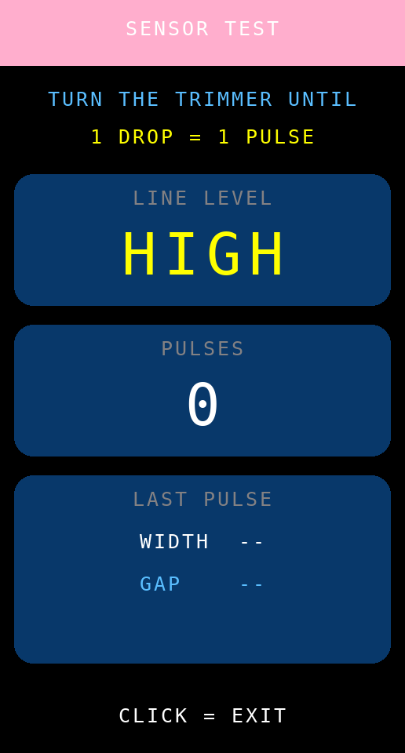

# Bed Station Node v7.6.0 — เซ็นเซอร์หยดแบบเอาต์พุตดิจิทัล + ผังขาใหม่

ต่อยอดจาก `ESP32-S3-Station-V_7_5_0` (หน้าจอแนวทาง IV BAG) โดยเปลี่ยน **วิธีตรวจจับหยด**
จากการอ่าน ADC มาเป็นการรับพัลส์ดิจิทัลจากเซ็นเซอร์ที่มีวงจรเปรียบเทียบในตัว
และจัดผังขา GPIO ใหม่ ส่วนการคำนวณอัตราไหล การแจ้งเตือน ESP-NOW และ Protocol v3
เหมือนเดิมทุกไบต์ จึงใช้คู่กับ **Host v4.6.0 / v4.7.0 / v4.9.x** ได้ทันที

## การต่อสาย (ผังขาใหม่)

| อุปกรณ์ / ขาบนโมดูล | ขา ESP32-S3 | เดิม (v7.5.0) |
|---|---|---|
| เซ็นเซอร์หยด **DO** | **GPIO 5** | GPIO 4 (ขา AO อนาล็อก) |
| เซ็นเซอร์หยด VCC / GND | 3V3 / GND | เหมือนเดิม |
| Passive buzzer | **GPIO 6** | GPIO 3 |
| ปุ่มกด (ลงกราวด์) | **GPIO 7** | GPIO 2 |
| จอ TFT CS / DC / RST / MOSI / SCLK / BLK | 9 / 10 / 11 / 12 / 13 / 8 | เหมือนเดิม |
| ไฟ RGB บนบอร์ด | 48 | เหมือนเดิม |

* ย้ายบัซเซอร์ออกจาก **GPIO 3** เพราะเป็น strapping pin — ถ้าต่อบัซเซอร์ที่ขานั้นแล้วมีแรงดันค้าง
  ตอนกดรีเซ็ต บอร์ดอาจบูตเข้าโหมดผิด ผังใหม่จึงย้ายทั้งชุด (เซ็นเซอร์/บัซเซอร์/ปุ่ม) มาไว้ที่ 5-7
  ให้อยู่ติดกับบล็อกของจอ (8-13) ต่อสายเป็นแถวเดียวได้
* **GPIO 4 ว่างแล้ว** ใช้เป็นขาวัดแรงดันแบตเตอรี่ได้ (ตั้ง `STATION_BAT_ADC_PIN` เป็น 4)
* ห้ามใช้ GPIO 33-37 บนบอร์ด N16R8 เพราะถูกใช้กับ PSRAM และ GPIO 19/20 เป็นขา USB

## เซ็นเซอร์แบบดิจิทัลทำงานอย่างไร

เซ็นเซอร์รุ่นนี้เปรียบเทียบสัญญาณในตัวโมดูลแล้วส่งออกมาเป็นพัลส์ **1 พัลส์ = 1 หยด**
เฟิร์มแวร์จึงไม่ต้องคาลิเบรตในซอฟต์แวร์อีกต่อไป (ความไวปรับที่โวลุ่มบนโมดูล)

| หัวข้อ | v7.5.0 (อนาล็อก) | v7.6.0 (ดิจิทัล) |
|---|---|---|
| วิธีอ่าน | `analogRead()` ทุกรอบ loop เทียบกับ threshold | ขัดจังหวะ (interrupt) ที่ขอบขาขึ้นของสาย DO |
| ความเสี่ยงพลาดหยด | มี — ถ้ารอบ loop ไปติดกับการวาดจอ/ส่ง ESP-NOW | ไม่มี — ISR ทำงานทันทีแล้วเก็บเวลาไว้ในคิว |
| การคาลิเบรต | Calibration Wizard 2 ขั้น เก็บ TH/HYS ลง NVS | ไม่มี ปรับที่โวลุ่มบนโมดูลแทน |
| การกันสัญญาณรัว | `minDropInterval` 55 ms | `DROP_DEBOUNCE_MS` 30 ms ทำใน ISR |

ค่าที่ปรับได้ตอนต้นไฟล์

| `#define` | ค่าเริ่มต้น | ความหมาย |
|---|---|---|
| `DROP_DO_PIN` | 5 | ขาที่ต่อสาย DO |
| `DROP_ACTIVE_HIGH` | 1 | 1 = ปกติ LOW มีหยดแล้วขึ้น HIGH · 0 = ปกติ HIGH มีหยดแล้วตก LOW (โมดูล LM393 ส่วนใหญ่) |
| `DROP_DEBOUNCE_MS` | 30 | พัลส์ที่มาเร็วกว่านี้ถือว่าเป็นการสั่นของวงจร ไม่ใช่หยดใหม่ |

เปลี่ยน `DROP_ACTIVE_HIGH` ค่าเดียว โค้ดจะสลับทั้งโหมด pull ภายใน (pull-down / pull-up)
และขอบสัญญาณที่ใช้ตรวจจับ (RISING / FALLING) ให้เองทั้งหมด

## หน้าทดสอบเซ็นเซอร์ (กดปุ่มค้าง 3 วินาที)

ใช้แทน Calibration Wizard เดิม สำหรับตอนติดตั้งและตอนหมุนโวลุ่มบนโมดูล

| ค่าที่แสดง | ควรเป็น |
|---|---|
| **LINE LEVEL** | ว่าง ๆ ต้องเป็น `LOW` และกระพริบเป็น `HIGH` ตอนหยดผ่านเท่านั้น |
| **PULSES** | เพิ่มขึ้นครั้งละ 1 ต่อ 1 หยด (ถ้าเพิ่มทีละ 2-3 คือโวลุ่มไวเกิน) |
| **WIDTH** | ความกว้างพัลส์ ราว 20-80 ms (ถ้าต่ำกว่า 3 ms จะขึ้นเตือน `PULSE TOO SHORT`) |
| **GAP** | ระยะห่างระหว่างหยด และอัตราที่คำนวณได้เป็น gtt/min |

พัลส์ที่เกิดระหว่างอยู่ในหน้านี้จะไม่ถูกนับเป็นหยดจริง และไม่ทำให้เตือนสายพับตอนออกจากหน้า

ตอนบูตเครื่องจะตรวจด้วยว่าสาย DO ไม่ได้ค้างอยู่ที่ระดับ "มีหยด" ถ้าค้าง
หน้า **3 LINK** จะขึ้น `CHECK SENSOR WIRING` สีแดงให้เห็นทันที

## แนวคิดการออกแบบ

* **ข้อความเท่าที่จำเป็น** — หน้าหลักมีข้อความเพียง 10 ชิ้น (เดิม 18 ชิ้น) ที่เหลือใช้ภาพและสีแทน
* **เห็นสถานะก่อนอ่านตัวเลข** — แถบสีที่ขอบบนและป้ายหมายเลขเตียงเปลี่ยนสีตามภาวะของเตียง
  (เขียว = ปกติ, เหลือง = ช้าไป, ส้ม = เร็วไป/ใกล้หมดถุง, แดง = ไม่มีการไหล, ฟ้า = พักการนับ)
* **ภาพแทนคำอธิบาย** — ถุงน้ำเกลือบนจอมีระดับน้ำลดลงจริงตามปริมาณที่ให้ไปแล้ว
  และกระเปาะหยดมีภาพหยดตกตามหยดจริงที่เซนเซอร์นับได้
* **ตัวเลขใหญ่พอมองจากปลายเตียง** — ค่าที่ต้องดูบ่อยใช้ขนาด 2-4 เท่าของตัวอักษรพื้นฐาน

## 4 หน้าจอ (คลิก 1 ครั้งเพื่อเปลี่ยนหน้า)

| หน้า | เนื้อหา |
|---|---|
| **1 IV BAG** | ถุงน้ำเกลือ + กระเปาะหยด + อัตราไหลปัจจุบัน / ปริมาณคงเหลือ / เวลาที่เหลือ / เวลาที่จะหมด + แถบความคืบหน้า |
| **2 PLAN** | อัตราเป้าหมาย, ปริมาณตามแผน, ให้ไปแล้ว, เวลาที่จะหมด (การ์ดตัวเลขใหญ่ 4 ใบ) + จุดเตือนเตรียมถุงใหม่ |
| **3 LINK** | สถานะเชื่อมต่อ Host (ONLINE/NO LINK, ช่อง, ความแรงสัญญาณ), ระดับสาย DO + จำนวนพัลส์สด, ข้อมูลเครื่อง |
| **4 TREND** | กราฟแท่งอัตราไหลย้อนหลัง 30 นาที (แท่งละ 1 นาที) พร้อมเส้นประสีเหลืองของอัตราเป้าหมาย |

หน้า TREND ช่วยให้เห็นว่าการไหล "สม่ำเสมอ" หรือ "ตกเป็นช่วง ๆ" โดยไม่ต้องเปิดหน้าเว็บของ Host
แท่งสีชมพูขวาสุดคือนาทีที่กำลังวัดอยู่ ขีดแดงที่ฐานคือช่วงที่ไม่มีการไหลเลย

## จอแจ้งเตือน

* **EMERGENCY (แดง)** — สายพับ/ไม่มีการไหล, เร็วเกิน, ช้าเกิน, ให้ครบตามแผน
  คลิก = พักเสียง 2 นาที, ดับเบิลคลิก = หยุด/เริ่มนับ (เช่น ตอนเปลี่ยนถุง)
* **NEXT BAG (ส้ม)** — ให้ไปแล้วถึง % ที่ตั้งจากหน้าเว็บ คลิก = รับทราบ (หยุดเตือนซ้ำ)
  ไม่ใช่เหตุวิกฤต จึงไม่เข้าจอแดงและไม่มีเสียงดังต่อเนื่อง

## ปุ่มกด

| การกด | ผลลัพธ์ |
|---|---|
| คลิก 1 ครั้ง | เปลี่ยนหน้า 1 → 2 → 3 → 4 (ในจอเตือน = พักเสียง 2 นาที / รับทราบ) |
| ดับเบิลคลิก | หยุด/เริ่มนับหยด |
| คลิก 3 ครั้ง | ตั้งหมายเลขเตียง 1-8 |
| กดค้าง 3 วินาที | หน้าทดสอบเซ็นเซอร์ (SENSOR TEST) |
| กดค้าง 5 วินาที | หน้าข้อมูลเครื่อง/ผู้พัฒนา |

## ภาพหน้าจออื่น ๆ

## หมายเหตุสำหรับการพัฒนาต่อ

* ฟอนต์มาตรฐานของ Adafruit GFX ไม่มีตัวอักษรไทย ข้อความบนจอจึงเป็นคำอังกฤษสั้น ๆ ตามที่ตกลงไว้
  หากต้องการภาษาไทยในอนาคต ต้องฝังฟอนต์บิตแมปไทย (แปลงเป็น GFXfont) เพิ่มประมาณ 20-40 KB
* ทุกหน้าวาดเฉพาะส่วนที่ค่าเปลี่ยน (มีตัวแปรแคชกำกับทุกชิ้น) และกราฟวาดใหม่เฉพาะแท่งล่าสุด
* การนับหยดไม่ขึ้นกับความเร็วของลูปหลักอีกต่อไป เพราะ ISR เก็บเวลาของพัลส์ลงคิว (8 ช่อง)
  แล้วลูปหลักค่อยมาประมวลผล ถ้าคิวเคยล้นจะนับไว้ที่ `dropIsrDropped` และขึ้นให้เห็นในหน้าทดสอบ
* **ยังไม่ได้ทดสอบบนฮาร์ดแวร์จริง** สิ่งที่ควรตรวจก่อนใช้งาน: ทิศทางสัญญาณของโมดูล
  (ดูที่หน้า SENSOR TEST ว่าว่าง ๆ เป็น LOW จริงไหม) และความกว้างพัลส์เทียบกับ `DROP_DEBOUNCE_MS`
* ดูหน้าจอทุกหน้าโดยไม่ต้องแฟลชลงบอร์ดได้ที่ `tools/station-preview/run.sh`
