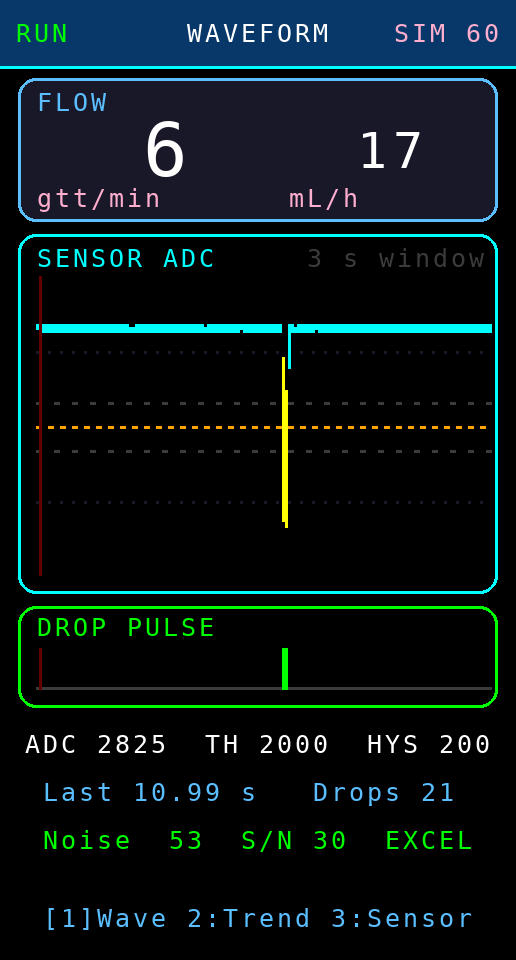
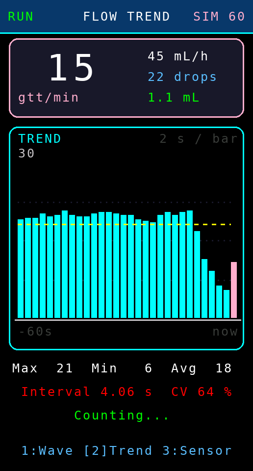
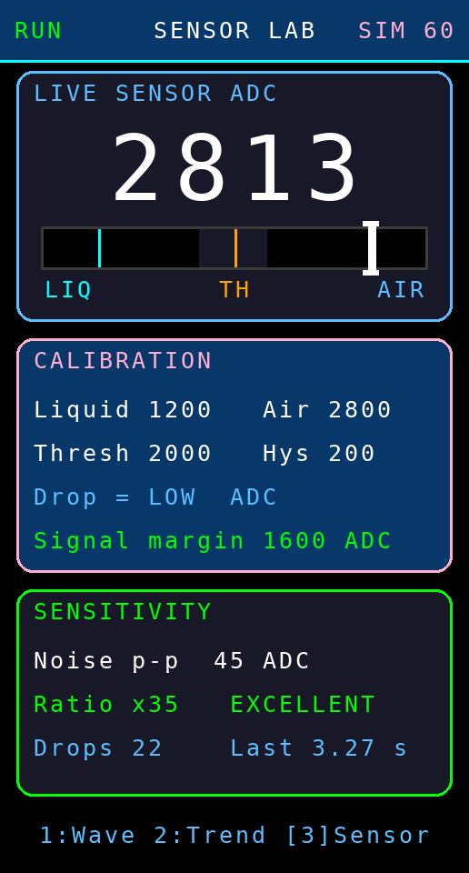
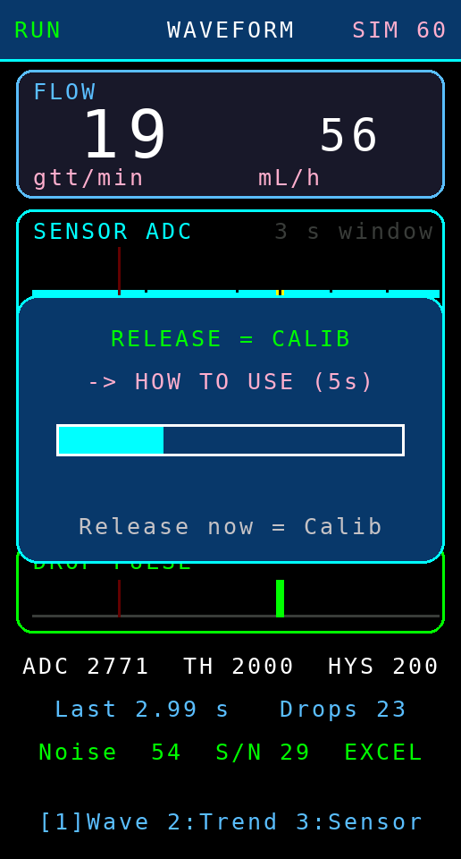
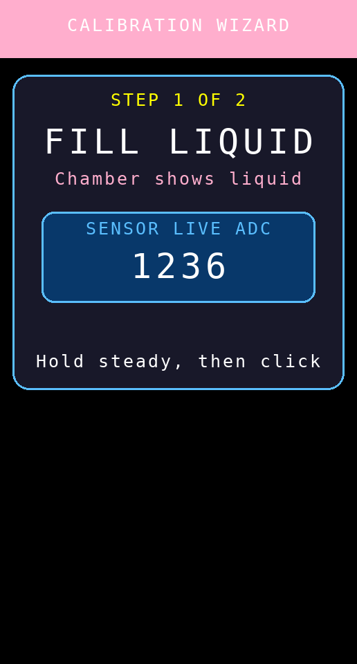
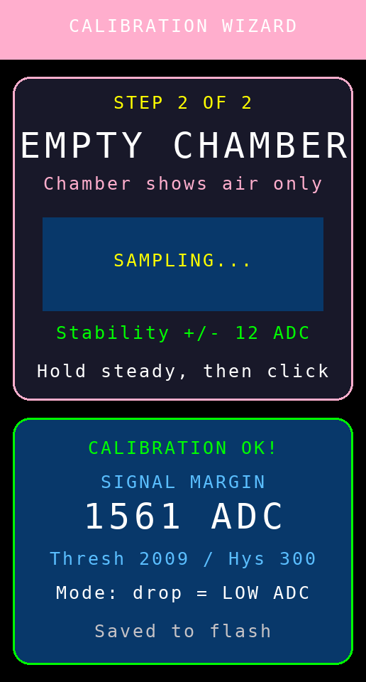

# ESP32-S3 Flow Simulation & Sensor Lab (v S1.0.0)

เฟิร์มแวร์สำหรับ **จำลองและแสดงกราฟสถานะการไหล** บนจอ TFT ของเครื่องประจำเตียง
ดัดแปลงจาก **Station v7.3.0** โดย **ตัดการเชื่อมต่อทุกชนิดออก**
(ไม่มี Wi-Fi / ESP-NOW / Host / NTP) เหลือเฉพาะงานที่ต้องการทดลองจริง ๆ คือ

1. **การตรวจจับหยด** (drop counting)
2. **การคาลิเบรตเซนเซอร์** (calibration wizard)

และเพิ่มส่วนแสดงผลกราฟเพื่อดู **แนวโน้มการไหล** และ **ความไวของเซนเซอร์**
ใช้เป็นเครื่องมือทดสอบบนโต๊ะ สาธิตให้พยาบาล/คณะกรรมการดู และเป็นต้นแบบหน้าจอสำหรับพัฒนาต่อ

---

## 1. ฮาร์ดแวร์และขาต่อ (เหมือนเครื่องจริงทุกขา)

| อุปกรณ์ | ขา ESP32-S3 |
|---|---|
| TFT ST7789 1.47" (172x320) | CS 9, DC 10, RST 11, MOSI 12, SCLK 13, BLK 8 |
| เซนเซอร์นับหยด (ขา AO อนาล็อก) | GPIO 4 |
| Passive buzzer | GPIO 3 |
| ปุ่มกด (ต่อลงกราวด์) | GPIO 2 (INPUT_PULLUP) |
| RGB LED บนบอร์ด | GPIO 48 |

**การคอมไพล์**: Arduino IDE / arduino-cli, บอร์ด *ESP32S3 Dev Module*, Arduino-ESP32 core 3.x
ไลบรารีที่ต้องมี: `Adafruit GFX Library`, `Adafruit ST7735 and ST7789 Library`

ค่าคาลิเบรตถูกเก็บใน Preferences **namespace เดียวกับเครื่องจริง (`st_cal`)**
จึงสลับแฟลชไปมาระหว่างเฟิร์มแวร์ทดลองกับเฟิร์มแวร์ใช้งานจริงได้โดยไม่ต้องคาลิเบรตใหม่

---

## 2. หน้าจอทั้ง 3 หน้า

### หน้า 1 — WAVEFORM (รูปคลื่นสัญญาณ)

* **กล่องบน**: อัตราไหลปัจจุบัน `gtt/min` (ตัวใหญ่) และ `mL/h`
* **กราฟรูปคลื่น**: ค่า ADC สดย้อนหลัง ~3 วินาที (152 คอลัมน์ x 20 ms)
  * เส้นสีฟ้า = สัญญาณปกติ, แท่งสีเหลือง = ช่วงที่ระบบนับว่าเป็น "หยด"
  * เส้นประสีส้ม = **เกณฑ์ตัดสิน (threshold)**
  * เส้นประสีเทาบน/ล่าง = ขอบ **ฮีสเทอรีซิส** (โซนกันสัญญาณสั่นทำให้นับซ้ำ)
  * แต่ละคอลัมน์เก็บทั้งค่าต่ำสุด-สูงสุดของช่วง จึงไม่พลาดยอดแหลมที่เกิดเร็วมาก
  * เส้นแดงเข้มที่กวาดไปทางขวา = ตำแหน่งการเขียนข้อมูลใหม่ (แบบออสซิลโลสโคป)
* **แถบ DROP PULSE**: สัญญาณดิจิทัล — แท่งเขียวคือช่วงเวลาที่เซนเซอร์ "เห็นหยด"
  ใช้ดูว่าหยดกว้างพอให้ระบบนับหรือไม่
* **3 บรรทัดล่าง**: ค่า ADC สด / threshold / hysteresis, เวลาห่างหยดล่าสุด, จำนวนหยด,
  สัญญาณรบกวน (Noise) และอัตราส่วนสัญญาณต่อสัญญาณรบกวน (S/N) พร้อมคำตัดสินความไว

### หน้า 2 — FLOW TREND (กราฟแท่งแนวโน้ม)

* กราฟแท่ง 30 แท่ง แท่งละ 2 วินาที = ดูย้อนหลัง **60 วินาที**
  * แท่งฟ้า = ช่วงที่ปิดแล้ว, แท่งชมพูขวาสุด = ช่วงที่กำลังวัดอยู่
  * เส้นประเหลือง = ค่าเฉลี่ยของหน้าต่างเวลา
  * ขีดแดงที่ฐาน = ช่วงที่ไม่มีการไหลเลย
  * ตัวเลขมุมซ้ายบนของกราฟคือค่าสูงสุดของแกนตั้ง (ปรับสเกลอัตโนมัติ)
* สรุปด้านล่าง: Max / Min / Avg, ระยะห่างหยดเฉลี่ยและ **CV %**
  (ค่าความผันผวน ยิ่งน้อยยิ่งไหลสม่ำเสมอ — เขียว ≤10%, ส้ม ≤25%, แดง >25%)

### หน้า 3 — SENSOR LAB (คาลิเบรตและความไว)

* ค่า ADC สดตัวใหญ่ + **เกจตำแหน่งสัญญาณ**: ขีดฟ้า = ค่าตอนมีสารน้ำ, ขีดน้ำเงิน = ตอนเป็นอากาศ,
  ขีดส้ม = เกณฑ์ตัดสิน, แถบเทา = โซนฮีสเทอรีซิส, ขีดขาว = ค่าปัจจุบัน
  (ถ้าขีดขาววิ่งข้ามขีดส้มทุกครั้งที่หยดผ่าน แปลว่าตั้งค่าได้ดี)
* กล่อง CALIBRATION: ค่าอ้างอิงที่บันทึกไว้ ทิศทางของสัญญาณ และ **Signal margin**
* กล่อง SENSITIVITY: สัญญาณรบกวนของเส้นฐาน, อัตราส่วน S/N และคำตัดสิน
  `EXCELLENT ≥20 / GOOD ≥10 / FAIR ≥5 / POOR <5`

---

## 3. ปุ่มกดเดียว ทำได้ทุกคำสั่ง

| การกด | ผลลัพธ์ |
|---|---|
| คลิก 1 ครั้ง | เปลี่ยนหน้า (WAVE → TREND → SENSOR) |
| คลิก 2 ครั้ง | RUN / HOLD (พักการนับชั่วคราว) |
| คลิก 3 ครั้ง | ล้างสถิติทั้งหมด (จำนวนหยด กราฟ ค่าเฉลี่ย) |
| คลิก 4 ครั้ง | เปิด/ปิดโหมดจำลอง และเลือกอัตรา 30 → 60 → 120 → 180 mL/h → ปิด |
| กดค้าง 3 วินาที | เข้า Calibration Wizard |
| กดค้าง 5 วินาที | หน้าวิธีใช้ / ผู้พัฒนา |

ไฟ LED: เขียว = นับปกติ, ม่วง = โหมดจำลอง, เหลือง = พักการนับ, แดง = ไม่มีการไหล,
กะพริบเขียวสว่าง 1 ครั้ง = นับได้ 1 หยด (มีเสียงติ๊กสั้นด้วย ปิดได้ที่ `SOUND_ON_DROP`)

---

## 4. โหมดจำลอง (SIM)

เมื่อเปิดโหมดจำลอง เฟิร์มแวร์จะ **สร้างสัญญาณเซนเซอร์สังเคราะห์** ขึ้นมาแทนการอ่าน ADC จริง:

* รูปหยดเป็นเส้นโค้งครึ่งไซน์กว้าง 45 ms จากค่าอากาศไปหาค่าสารน้ำ
* มีสัญญาณรบกวนสุ่มประมาณ ±2% ของช่วงสัญญาณ
* จังหวะหยดตามอัตราที่เลือก บวกความคลาดเคลื่อนสุ่ม ±8%
* ทุก ๆ 20 หยดจะ **จำลองภาวะหยุดไหล** 8 วินาที เพื่อให้เห็นกราฟตกและสถานะ `NOFLOW`

ค่าที่สร้างขึ้นถูกส่งเข้าเส้นทางตรวจจับชุดเดียวกับของจริงทุกขั้นตอน
(threshold → hysteresis → debounce → คำนวณอัตราไหล) จึงใช้ทดสอบหน้าจอและตรรกะได้เสมือนจริง
โดยไม่ต้องต่อเซนเซอร์ **แต่คาลิเบรตไม่ได้** — ต้องปิดโหมดจำลองก่อน (เครื่องจะเตือนให้เอง)

---

## 5. Calibration Wizard

1. **STEP 1** ให้กระเปาะมีสารน้ำ → ค้างให้นิ่ง (ดูบรรทัด `Stability +/-` ให้เป็นสีเขียว) → คลิก
2. **STEP 2** ให้กระเปาะว่าง → คลิก
3. ระบบเฉลี่ย 50 ตัวอย่างต่อจุด แล้วคำนวณ
   * `threshold = (liquid + air) / 2`
   * `hysteresis = 20% ของ margin` (จำกัดไว้ 60–300)
   * ทิศทางสัญญาณอัตโนมัติ (รองรับเซนเซอร์ทั้งสองขั้ว)
4. ถ้า margin < 80 ADC จะไม่บันทึก และคงค่าเดิมไว้

---

## 6. พารามิเตอร์ที่ปรับได้บ่อย (ต้นไฟล์ .ino)

| ค่า | ความหมาย | ค่าเริ่มต้น |
|---|---|---|
| `DROP_FACTOR` | gtt/mL ของชุดให้สารน้ำที่ใช้ทดลอง | 20 |
| `MIN_DROP_INTERVAL` | เวลากันนับซ้ำ (ms) | 55 |
| `SOUND_ON_DROP` | เสียงติ๊กทุกหยด | true |
| `WAVE_BUCKET_MS` | เวลาต่อ 1 คอลัมน์ของกราฟคลื่น (ยิ่งน้อยยิ่งละเอียด แต่หน้าต่างเวลาสั้นลง) | 20 |
| `TREND_BIN_MS` | เวลาต่อ 1 แท่งของกราฟแนวโน้ม | 2000 |
| `SIM_RATES` | อัตราของโหมดจำลอง (mL/h) | 30/60/120/180 |

---

## 7. ข้อควรทราบสำหรับการพัฒนาต่อ

* **ฟอนต์**: ใช้ฟอนต์มาตรฐานของ Adafruit GFX ซึ่งไม่รองรับภาษาไทย ข้อความบนจอจึงเป็นอังกฤษทั้งหมด
  ถ้าต้องการภาษาไทยต้องฝังฟอนต์บิตแมปไทยเพิ่ม (เช่น แปลงฟอนต์เป็น GFXfont) — คำอธิบายภาษาไทย
  ในโค้ดอยู่ในคอมเมนต์เท่านั้น
* **ภาระของ SPI**: กราฟคลื่นวาดทีละ 1 คอลัมน์ต่อ 20 ms ไม่ใช่ล้างทั้งกราฟ จึงไม่แย่งเวลาจนพลาดหยด
  หากเพิ่มกราฟใหม่ ควรยึดหลักเดียวกัน (วาดเฉพาะส่วนที่เปลี่ยน + ใช้ข้อความความกว้างคงที่เขียนทับ)
* **การย้ายกราฟกลับไปใช้ในเครื่องจริง**: ฟังก์ชันชุด `drawWaveColumn* / drawPulseColumn /
  drawTrendChart / drawSensorGauge` ไม่ผูกกับตัวแปรของ Host เลย ยกไปวางในเฟิร์มแวร์ v7.3.0
  เป็นหน้าที่ 4 ได้ทันที เพียงส่งค่า ADC และ `dropState` เข้าไป
* **พรีวิวหน้าจอบน PC**: ดู `tools/screen-preview/` — คอมไพล์สเก็ตช์ด้วย Arduino API จำลอง
  แล้วเรนเดอร์ภาพ PNG ออกมา ใช้ตรวจผังหน้าจอก่อนแฟลชจริง
