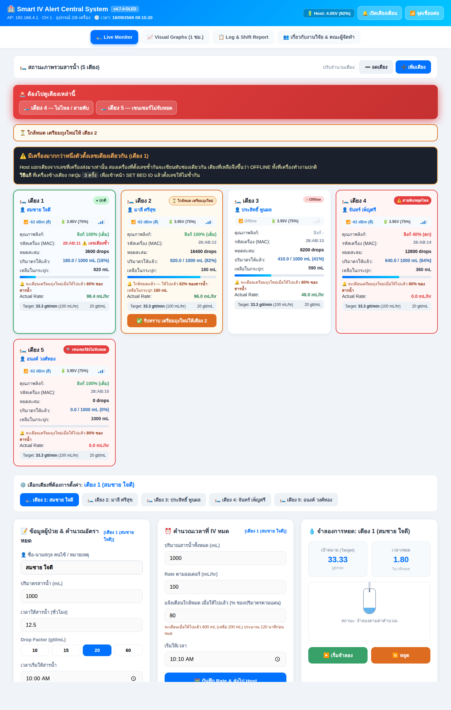
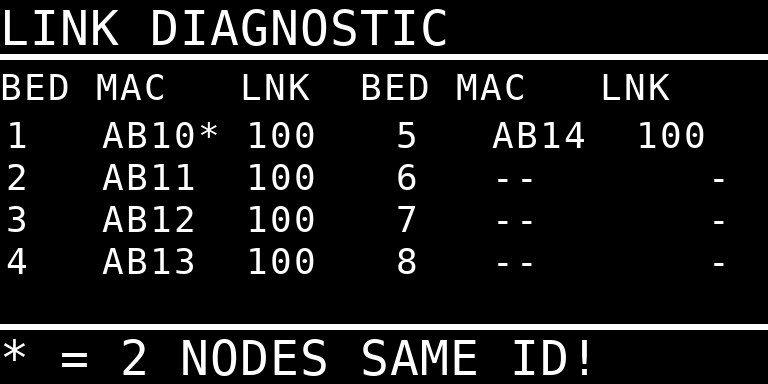
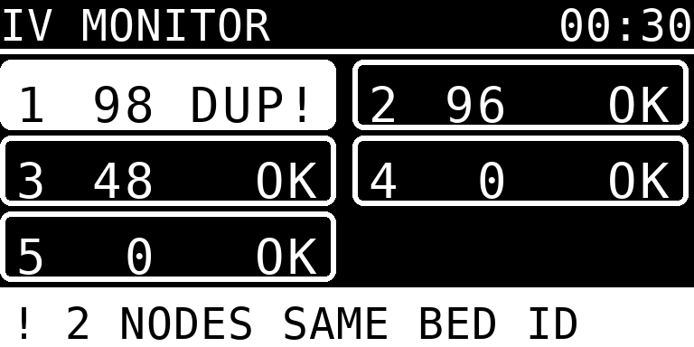
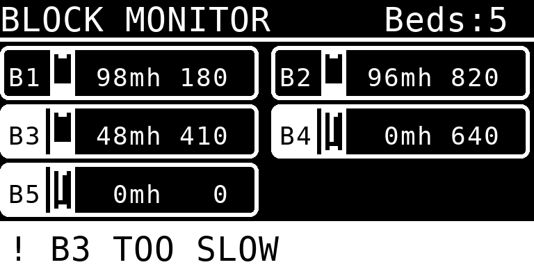
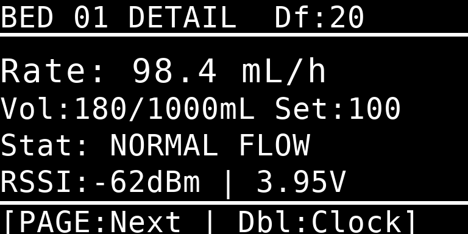
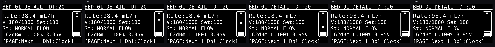
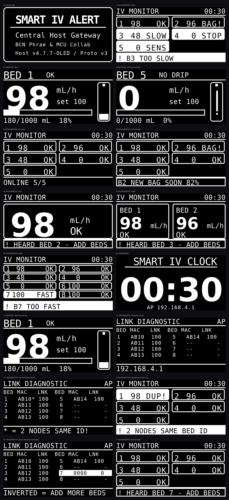

# Central Host Gateway v4.7.5-OLED — แก้บั๊กลำดับโค้ดและหยดปลอมบนแอนิเมชัน

ต่อยอดจาก **Host จอ OLED v4.7.4** แก้ 2 จุด ส่วนอื่นไม่เปลี่ยน
โครงสร้างแพ็กเก็ต (Protocol v3) เท่าเดิมทุกไบต์ ใช้คู่กับ Station รุ่นเดิมได้ทันที

## 1. บั๊ก `oldPlan` อ่านค่าหลังเขียนทับ (ใหม่ใน v4.7.5)

ใน `handleStationConfig()` ของเดิมประกาศ `oldPlan` **ใต้** บล็อกที่เขียนค่าใหม่ไปแล้ว

```cpp
if (server.hasArg("volume")) {
  c.planVolumeMl = v;          // เขียนทับไปแล้ว
}
...
float oldPlan = c.planVolumeMl; // เพิ่งมาอ่าน = ได้ค่าใหม่
if (nearChanged || c.planVolumeMl != oldPlan) { ... }   // เป็นเท็จเสมอ
```

`oldPlan` จึงเท่ากับค่าใหม่เสมอ เงื่อนไขเทียบเป็นเท็จตลอด

**ผลทางคลินิก** เมื่อพยาบาลเปลี่ยนปริมาตรถุงอย่างเดียว (ไม่แตะ `nearpct`)
`nearEndAck` ไม่ถูกล้าง ถ้าเตือนใกล้หมดไปแล้วสำหรับถุงเดิม **ถุงใหม่จะไม่เตือนอีกเลย**

แก้โดยย้ายการอ่านค่าเดิมขึ้นไปก่อนบล็อกที่เขียนทับ

## 2. แอนิเมชันหยดวาด "หยดปลอม" ที่อัตราต่ำ (ใหม่ใน v4.7.5)

`dripPeriodMs()` ของเดิมบีบคาบไว้ที่ 20 วินาที แต่ `dripAnimPhase()` ใช้ `% period`
โดยที่ `lastDropAtMs` เปลี่ยนเฉพาะตอนมีหยดจริง

```
3 mL/h ที่ DF 20 -> คาบจริง 60 วินาที  แต่ถูกวาดทุก 20 วินาที
= หยดปลอม 2 หยดคั่นระหว่างหยดจริงทุกครั้ง
```

ขัดกับหลักการ "ล็อกเฟสกับหยดจริง" ที่เขียนไว้ในคอมเมนต์ของฟังก์ชันเอง

แก้ 2 อย่าง

* เพดานคาบเปลี่ยนจาก 20 วินาที เป็น `MAX_OCCLUSION_MS` (เลยจากนี้เตียงถูกตีเป็น
  `DRIP_ALERT` อยู่แล้ว) คาบที่ใช้วาดจึงเป็นคาบจริง
* เพิ่มการตัด เมื่อเลยกำหนดหยดถัดไปเกิน 3 เท่าของคาบ = การไหลเปลี่ยนหรือหยุด
  แต่ยังไม่ถึงเกณฑ์สายพับ ให้หยุดวาดและรอหยดจริงส่ง `msSinceLastDrop` มา resync เฟส

---

## เอกสารเดิมจากรุ่นก่อนหน้า

ต่อยอดจาก **Host จอ OLED v4.7.3** โครงสร้างแพ็กเก็ต ESP-NOW **ไม่เปลี่ยนแม้แต่ไบต์เดียว**



## ทำไม v4.7.3 ยังแก้ไม่หาย

v4.7.3 แก้เรื่อง **จังหวะส่งชนกัน** ซึ่งเป็นสาเหตุหนึ่งจริง แต่ไม่ใช่สาเหตุเดียว

เวอร์ชันนี้จึงเขียนชุดทดสอบที่ **ป้อนแพ็กเก็ตเสมือนเข้าฟังก์ชันรับของ Host โดยตรง**
บนเครื่อง PC (`tools/host-rx-test/run.sh`) เพื่อพิสูจน์ว่าตรรกะรับข้อมูลถูกหรือผิด

```
ทดสอบ 1: 8 เตียง เลขเตียงไม่ซ้ำ ส่งครบทุกใบ      -> Host เห็นครบทั้ง 8 เตียง   ผ่าน
ทดสอบ 4: ตัวนับเวลา millis() ล้นรอบ               -> ยังออนไลน์ครบ             ผ่าน
```

**ตรรกะการรับของ Host ไม่ผิด** ถ้าแพ็กเก็ตมาถึงและเลขเตียงไม่ซ้ำ Host เห็นครบทุกครั้ง
ดังนั้นอาการที่เหลือมีได้แค่สามอย่าง และสองอย่างแรกคือ **ปัญหาการตั้งค่า ไม่ใช่บั๊ก**

### 1. สองเครื่องตั้งเลขเตียงซ้ำกัน  ← สาเหตุที่ตรงกับอาการที่สุด

Host แยกเตียงจาก `stationId` ในแพ็กเก็ต **เท่านั้น** ไม่ได้ดู MAC
สองเครื่องที่ตั้งเลขเดียวกันจึงเขียนทับช่องเดียวกัน เตียงที่เหลือขึ้น `OFFLINE`

และ **จอของเครื่องข้างเตียงทั้งสองตัวขึ้น ONLINE ปกติ และดึงค่าจาก Host มาแสดงได้ครบ**
เพราะทั้งคู่รับ Sync ของเลขเตียงนั้นได้เหมือนกัน — ตรงกับที่รายงานมาทุกข้อ

ชุดทดสอบจำลองอาการนี้ได้ตรง ๆ

```
ทดสอบ 5: สองบอร์ดตั้งเลขเตียงซ้ำกัน
    เตียง1 online=1  เตียง2 online=0  เตียง3 online=0
```

เครื่องทุกตัวออกจากโรงงานด้วยเลขเตียงเริ่มต้น `1` เหมือนกันหมด
(`stationPrefs.getUChar("id", 1)`) ถ้าลืมตั้งแม้เครื่องเดียวก็เกิดอาการนี้ทันที

### 2. เลขเตียงเกินจำนวนเตียงที่เปิดใช้

Host แสดงเฉพาะเตียง `1..activeStationCount` ถ้าเปิดใช้ไว้ 5 เตียง แต่มีเครื่องตั้งเลข 7
ข้อมูลของเครื่องนั้นจะถูกมองข้ามเงียบ ๆ และเตียงที่ยังไม่มีเครื่องก็ขึ้น `OFFLINE`

### 3. แพ็กเก็ตไม่มาถึงจริง (แก้ไปแล้วใน v4.7.3 + Station v7.x.x ใหม่)

## สิ่งที่เพิ่ม: ทำให้สองข้อแรกมองเห็นได้

เดิมทั้งสองกรณีนี้ **ไม่มีทางรู้เลยจากหน้าจอไหน** เวอร์ชันนี้แก้ตรงนั้น

### Host จำ MAC ของเครื่องที่ส่งมาในแต่ละเลขเตียง

```cpp
if (!s.macKnown) { memcpy(s.srcMac, src, 6); s.macKnown = true; }
else if (memcmp(s.srcMac, src, 6) != 0) {
  if (++s.idFlipCount >= ID_CONFLICT_MIN_FLIPS) s.idConflict = true;   // สลับไปมา = เลขซ้ำ
}
```

MAC ที่สลับไปมาในเลขเตียงเดียวกันแปลว่ามีมากกว่าหนึ่งเครื่องใช้เลขนั้น
(เครื่องเดิมรีบูตซ้ำ ๆ ไม่เข้าเงื่อนไข เพราะ MAC ไม่เปลี่ยน — มีทดสอบข้อ 7 คุมไว้)

### หน้า LINK DIAGNOSTIC บนจอ OLED

กดปุ่มเปลี่ยนหน้าไปจนสุดวง (ถัดจากหน้ารายละเอียดเตียงสุดท้าย)



ตารางเลขเตียง 1-8 บอกว่าแต่ละเลข **ได้ยินจากเครื่องตัวไหน (MAC ท้าย 2 ไบต์)**
และคุณภาพลิงก์เท่าไร

* `*` ต่อท้าย MAC = เลขเตียงนี้มีมากกว่าหนึ่งเครื่องส่งมา
* แถวกลับสี = ได้ยินเลขเตียงนี้ แต่ยังไม่ได้เปิดใช้ (ต้องกดเพิ่มจำนวนเตียง)
* `--` = ไม่เคยได้ยินเลขนี้เลยในหนึ่งนาทีที่ผ่านมา

### แถบเตือนบนหน้ารวมและบนหน้าเว็บ



หน้าเว็บขึ้นแถบสีเข้มพร้อมวิธีแก้เป็นขั้นตอน และการ์ดของแต่ละเตียงเพิ่มแถว
**รหัสเครื่อง (MAC)** เพื่อยืนยันด้วยตาว่าทุกเตียงเป็นคนละเครื่องจริง

### ขั้นตอนตรวจเมื่อเจออาการนี้อีก

1. เปิดหน้าเว็บ ดูแถบวินิจฉัยด้านบน — ถ้าขึ้นว่าเลขซ้ำ จบ แก้ตามที่บอกได้เลย
2. ดูแถว **รหัสเครื่อง (MAC)** ของทุกเตียง ต้องไม่ซ้ำกันเลย
3. ที่เครื่องข้างเตียงแต่ละตัว กดปุ่ม **3 ครั้ง** เข้าหน้า `SET BED ID` ดูเลขให้ครบทุกตัว
4. ถ้า MAC ไม่ซ้ำและเลขไม่ซ้ำ แต่ยังขึ้น OFFLINE ให้ดูช่อง **คุณภาพลิงก์** —
   ต่ำกว่า 60% ทั้งที่ RSSI ดี แปลว่ายังมีแพ็กเก็ตชนกันอยู่

## จอ OLED: ตัดสิ่งที่มองไม่เห็นออก

จอ 128x64 ที่ติดอยู่บนผนังหรือโต๊ะพยาบาล มองจากระยะจริงแล้วฟอนต์ 4x6 อ่านไม่ออก
เวอร์ชันนี้จึงตัดองค์ประกอบที่ไม่ได้ใช้ตัดสินใจออก แล้วเอาที่ว่างไปขยายตัวอักษร



| เดิม (v4.7.3) | ใหม่ (v4.7.4) |
|---|---|
| `B1 [กระเปาะหยด] 98mh 180` ฟอนต์ 4x6 | `1  98      OK` ฟอนต์ 6x10 (ใหญ่ขึ้น 2.5 เท่า) |
| มีกระเปาะหยดทุกการ์ด (กว้าง 6 px มองไม่เห็นจริง) | **ย้ายไปหน้ารายละเอียดของแต่ละเตียง** ตามที่ขอ |
| มีปริมาตรสะสมในการ์ด | ตัดออก (อยู่ในหน้ารายละเอียดแล้ว) |
| เตียงวิกฤตทำป้ายเลขทึบ | **ทั้งการ์ดทึบ** เห็นได้จากท้ายห้อง |
| หัวจอ `Beds:5` ซ้ำกับแถบล่าง | เปลี่ยนเป็น **นาฬิกา** |

สามอย่างที่เหลือในการ์ดคือสิ่งที่ตัดสินใจได้ทันที — **เลขเตียง / อัตราไหล / คำสถานะ**
คำสถานะชิดขวาเสมอ ตาจึงกวาดลงเป็นแนวตั้งเพื่อหาคำผิดปกติได้

| คำ | ความหมาย | คำ | ความหมาย |
|---|---|---|---|
| `OK` | ปกติ | `STOP` | สายพับ / ไม่ไหล |
| `FAST` | ไหลเร็วเกิน | `SENS` | เซนเซอร์ยังไม่จับหยด |
| `SLOW` | ไหลช้าเกิน | `DONE` | ให้ครบตามแผนแล้ว |
| `BAG!` | ใกล้หมด ยังไม่รับทราบ | `PAUS` | พยาบาลสั่งหยุดนับ |
| `DUP!` | เลขเตียงซ้ำกับเครื่องอื่น | `OFF` | ติดต่อไม่ได้ |

### หน้ารายละเอียดของแต่ละเตียง — ที่อยู่ใหม่ของกระเปาะหยด



* อัตราไหลเป็นตัวเลขใหญ่ที่สุดบนจอ (ฟอนต์ 32 px)
* กระเปาะหยดชิดขวา **สูง 46 px** ใหญ่พอจะเห็นหยดวิ่งจริง (เดิมในหน้ารวมกว้างแค่ 6 px)
* แถบความคืบหน้าของถุงแทนตัวเลขปริมาตรสองชุดที่อ่านยาก
* จังหวะหยดยังล็อกเฟสกับหยดจริงเหมือน v4.7.3 (`lastDropAtMs` + คาบจากอัตราไหลจริง)



## สิ่งที่เปลี่ยนใน v4.7.2 (ยังอยู่ครบในเวอร์ชันนี้)

### 1. สถานะปกติมีกรอบสีเขียว

เดิมเตียงที่ปกติ **ไม่มีกรอบ** ทำให้แยกจากเตียงออฟไลน์ด้วยสายตายาก
ตอนนี้การ์ดของเตียงปกติมีกรอบเขียวและเงาเขียวจาง มองแวบเดียวรู้ว่าเตียงไหนเรียบร้อย

| สี | ความหมาย |
|---|---|
| 🟢 กรอบเขียว | ปกติ |
| 🟠 กรอบส้ม | ใกล้หมด เตรียมถุงใหม่ |
| 🔴 กรอบแดง + การ์ดกะพริบ | ต้องไปดูเดี๋ยวนี้ |
| ⏸️ กรอบเหลือง | หยุดนับชั่วคราว |
| ⚪ ไม่มีสี | ออฟไลน์ |

### 2. ใกล้หมดบอกเป็น % ของสารน้ำ และบอกว่าเหลือเท่าไหร่

เดิมบรรทัดเตือนเขียนว่า `เตือนเตรียมถุงใหม่ที่ 80% (800 mL)` ซึ่งตัวเลข mL
เป็นแค่ "จุดที่จะเตือน" ไม่ได้บอกว่าตอนนี้เหลือเท่าไหร่จริง ๆ

ตอนนี้

* **เพิ่มแถว `เหลือในกระปุก: N mL` ในการ์ดทุกใบ** (คำนวณจากแผนลบด้วยที่ให้ไปแล้ว)
  ตัวเลขเปลี่ยนเป็นสีส้มเมื่อเหลือไม่ถึง 100 mL
* บรรทัดเตือนเปลี่ยนเป็น
  * ยังไม่ถึงเกณฑ์ → `จะเตือนเตรียมถุงใหม่เมื่อให้ไปแล้ว 80% ของสารน้ำ`
  * ถึงเกณฑ์แล้ว → `ใกล้หมดแล้ว — ให้ไปแล้ว 82% ของสารน้ำ · เหลือในกระปุก 180 mL`

### 3. แถบแจ้งสถานะรวมบนหน้า Live Monitor

เดิมต้องกวาดตาหาว่าการ์ดใบไหนเป็นสีแดง ตอนนี้มีแถบสรุปอยู่บนสุดของหน้า
บอกชัดว่า **เตียงไหนเป็นอะไร** ครอบคลุมทั้ง 4 เหตุที่เป็นสีแดง (และเซนเซอร์ไม่จับหยด)

```
🚨 ต้องไปดูเตียงเหล่านี้
   🛏️ เตียง 3 — ไหลช้าเกิน    🛏️ เตียง 4 — ไม่ไหล / สายพับ    🛏️ เตียง 5 — เซนเซอร์ไม่จับหยด
```

และมีแถบสีส้มแยกต่างหากสำหรับเตียงที่ใกล้หมด ซึ่งเป็นเรื่อง "เฝ้าดู" ไม่ใช่เหตุวิกฤต

```
⏳ ใกล้หมด เตรียมถุงใหม่ให้ เตียง 2
```

แถบจะซ่อนเองเมื่อไม่มีเหตุ จึงไม่รบกวนสายตาตอนทุกอย่างปกติ

### 4. เสียงเตือนกระตุ้นความสนใจขึ้น

| | เดิม | ใหม่ |
|---|---|---|
| รูปคลื่น | ไซน์ (นุ่ม กลืนกับเสียงรอบข้าง) | **สี่เหลี่ยม** (ฮาร์มอนิกมาก แทรกผ่านเสียงในหอผู้ป่วยได้ดีกว่า) |
| รูปแบบ | บี๊บเดียว 880 Hz 0.5 วินาที | **4 พัลส์สลับ 1320/990 Hz** แบบเสียงรถพยาบาล |
| การขึ้นเสียง | ค่อย ๆ ดัง | ขึ้นภายใน 12 ms = สะดุดหู |
| การซ้ำ | เรียกทุกรอบ poll (ทับกันเอง) | ปล่อยเป็นชุดทุก **2 วินาที** จนกว่าเหตุจะหาย |

ปุ่ม 🔔 เปิด/ปิดเสียงเตือน ยังทำงานเหมือนเดิม และเสียงเตือนใกล้หมด (เสียงเบา 3 ครั้ง)
ไม่เปลี่ยน เพราะเป็นคนละระดับความเร่งด่วน

### 5. ป้ายเวอร์ชันอ่านค่าจริง

หัวหน้าเว็บเคยค้างอยู่ที่ `v4.6.0` ตอนนี้อ่านจาก `APP_VERSION` ที่ Host ส่งมาใน `/api/data`

## ดูหน้าเว็บโดยไม่ต้องมีบอร์ด

```bash
tools/dashboard-preview/run.sh
```

ดึง `PAGE_INDEX` ออกจาก `web_dashboard.h` ใส่ข้อมูลจำลอง 5 เตียงที่ครบทุกสถานะ
(ปกติ / ใกล้หมด / ไหลช้า / ไม่ไหล / เซนเซอร์ไม่จับหยด) แล้วถ่ายภาพหน้าจอด้วย Chromium
ใช้ตรวจหน้าตาและพฤติกรรมของ Dashboard ได้ก่อนแฟลชลงบอร์ด

## ดูหน้าจอ OLED โดยไม่ต้องมีบอร์ด

```bash
tools/oled-preview/run.sh
```

คอมไพล์เฟิร์มแวร์ตัวจริงบน PC โดยแทน U8g2 ด้วยตัวบันทึกคำสั่งวาด
แล้วเรนเดอร์กลับเป็นภาพ 128x64 ขาวดำ (ขยาย 6 เท่า) ครบทุกหน้า:
หน้าเปิดเครื่อง / หน้ารวมแบบบล็อก 1-2-5-8 เตียง / หน้ารายละเอียดเตียง /
หน้าเตียงที่เซนเซอร์ไม่จับหยด / หน้าใกล้หมด / หน้าประหยัดพลังงาน

ภาพทั้งหมดอยู่ใน [`docs/screens-oled/`](../../docs/screens-oled/)



ฟอนต์ความกว้างคงที่ (4x6, 5x8, 6x10, 7x13, 7x14B) เรนเดอร์ตรงตำแหน่งพิกเซลจริง
ใช้ตรวจการวางเลย์เอาต์และข้อความล้นขอบจอได้แม่นยำ ส่วนฟอนต์สัดส่วน
(helvB10/12, logisoso16/32) เป็นการประมาณขนาด — รูปทรงตัวอักษรจะไม่เหมือนของจริงเป๊ะ

## หมายเหตุ

* **ยังไม่ได้ทดสอบบนฮาร์ดแวร์จริง** เมื่อแฟลชแล้วให้ทำตาม "ขั้นตอนตรวจ" ด้านบนก่อน
  เพราะถ้าสาเหตุคือเลขเตียงซ้ำ จะเห็นผลทันทีโดยไม่ต้องแก้อะไรในโค้ดอีก
* เวอร์ชันนี้ **ไม่ได้เปลี่ยนตรรกะการรับข้อมูล** เลย เพิ่มแต่การจำ MAC และการแสดงผล
  ตรรกะเดิมผ่านชุดทดสอบทั้ง 7 ข้อใน `tools/host-rx-test/`
* v4.7.3 ยังอยู่ในที่เก็บครบถ้วนสำหรับย้อนกลับ

* ถ้าจอ OLED ภาพรวนหลังอัปเดต ให้ลด `OLED_I2C_HZ` กลับเป็น `100000`

* **ยังไม่ได้ทดสอบบนฮาร์ดแวร์จริง** — ภาพด้านบนมาจากเบราว์เซอร์จริงพร้อมข้อมูลจำลอง
  สิ่งที่ควรลองบนเครื่องจริง: เสียงเตือนดังพอในหอผู้ป่วยหรือไม่ (ปรับค่า `0.32`
  ในฟังก์ชัน `playAlarmTone()` ได้ถ้าต้องการดังขึ้น) และแถบแจ้งเตือนอ่านง่ายบนจอที่ใช้จริงไหม
* v4.7.1 ยังอยู่ในที่เก็บครบถ้วนสำหรับย้อนกลับ
* รายละเอียดการรองรับ Station v7.5.1 / v7.7.0 และการเตือน "เซนเซอร์ยังไม่จับหยด"
  อยู่ใน [README ของ v4.7.1](https://github.com/kittiphun-rut/IV-Monitor-BCNPH/blob/release/07-s7.7.0-h4.7.1/firmware/**Host จอ OLED v4.7.1**/README.md)
