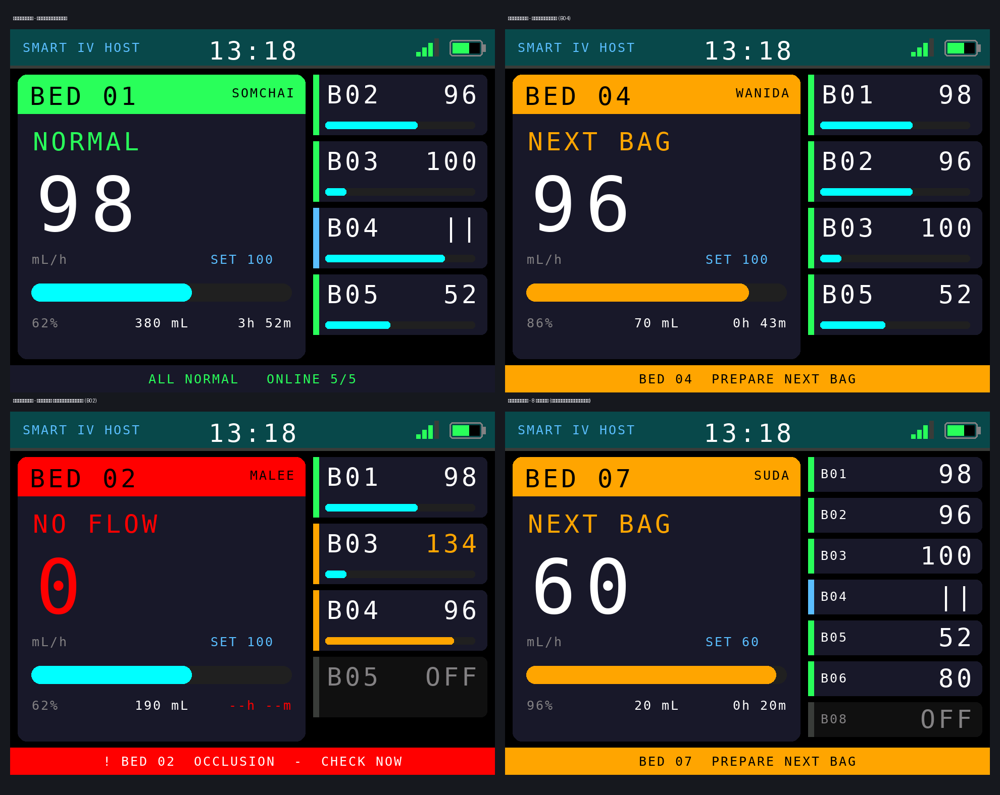
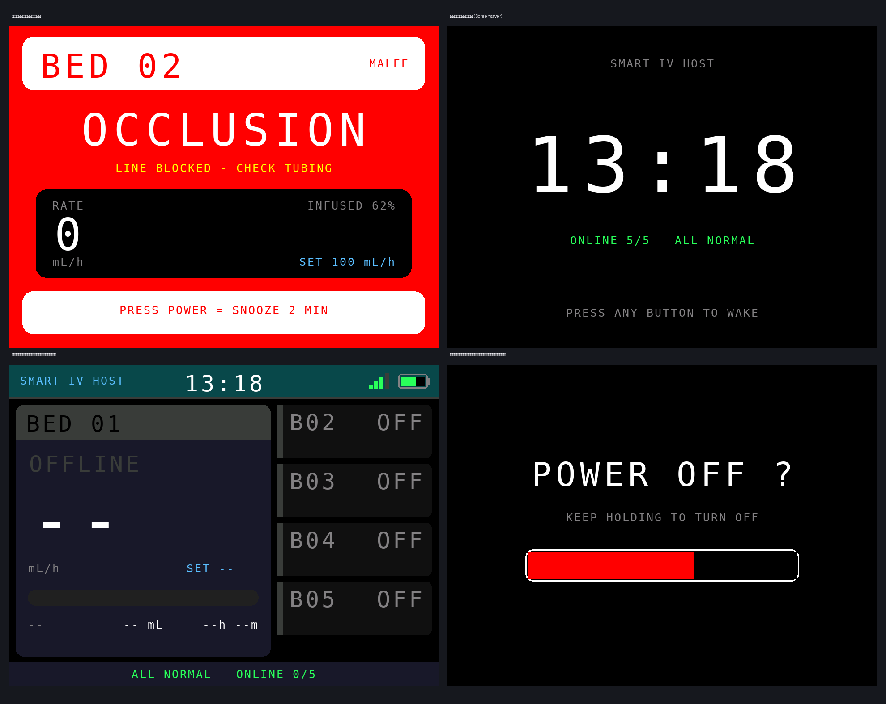

# เครื่องส่วนกลาง จอ TFT 2.8" v4.8.1 — แยกโค้ดวาดจอออกเป็น `HostScreen.h`

ไฟล์หลักเดิมยาวจนหาของยาก รุ่นนี้ย้ายโค้ดที่ทำหน้าที่วาดจอทั้งหมดออกไปไว้ใน
ไฟล์ `HostScreen.h` ของสเก็ตช์เดียวกัน Arduino IDE แสดงเป็นแท็บคู่กัน เปิดพร้อมกันได้

```
ย้ายออกไป 282 บรรทัด    ไฟล์หลักเหลือ 1563 บรรทัด
```

**เป็นการย้ายที่อยู่ล้วน ๆ ไม่ได้แก้เนื้อในแม้แต่บรรทัดเดียว**
ตรรกะการวัด การแจ้งเตือน และโครงสร้างแพ็กเก็ต Protocol v3 เท่าเดิมทุกไบต์
ใช้คู่กับรุ่นเดิมของอีกฝั่งได้ทันที

## พิสูจน์อย่างไรว่าพฤติกรรมไม่เปลี่ยน

เรนเดอร์ภาพหน้าจอจากโค้ด **ก่อนแยก** และ **หลังแยก** แล้วเทียบทีละพิกเซล
ได้ผลว่าเหมือนกันทุกจุดครบทั้ง **8 ภาพ**

ก่อนหน้านี้เทียบแบบนี้ไม่ได้ เพราะตัวจำลองอ่านนาฬิกาจริงของเครื่อง
ภาพจึงเปลี่ยนทุกครั้งที่รัน รุ่นนี้ตรึงนาฬิกาไว้แล้วที่ `previewNow()`
ใน `tools/screen-preview/Arduino.h` (เปลี่ยนได้ด้วย `PREVIEW_EPOCH`)
ผลพลอยได้คือภาพใน `docs/` ไม่ขึ้นว่าถูกแก้ทุกครั้งที่รันชุดตรวจอีกต่อไป

## กฎที่ห้ามผิดเมื่อแก้ต่อ

ไฟล์ `HostScreen.h` ถูก `#include` **ท้ายไฟล์หลัก ก่อน `setup()`** ห้ามย้ายขึ้นไปบนสุด
เพราะโค้ดในนั้นใช้ตัวแปรและฟังก์ชันช่วยที่ประกาศไว้ด้านบน

ถ้าโค้ดเหนือบรรทัด `#include` เรียกฟังก์ชันที่ย้ายไปแล้ว ต้องประกาศล่วงหน้าไว้
ในไฟล์หลัก และห้ามใส่ค่าปริยายซ้ำทั้งที่ประกาศและที่นิยาม
ตรวจด้วย `bash tools/split-check/run.sh`

---

# Central Host Gateway v4.8.0-TFT — จอสี 2.8 นิ้ว (ST7789V)

ดัดแปลงจาก **Host จอ OLED v4.7.0** โดย **เปลี่ยนเฉพาะส่วนแสดงผล** จากจอ OLED 1.3" ขาวดำ
มาเป็นจอสี TFT 2.8" ความละเอียด 240x320 (ใช้แนวนอน 320x240)
ตรรกะการวัด การแจ้งเตือน ESP-NOW (Protocol v3) และหน้าเว็บทั้งหมดเหมือน v4.7.0 ทุกประการ
จึงใช้คู่กับ **Station v7.4.x / v7.5.x** ได้ทันที



## โครงสร้างไฟล์ในโฟลเดอร์นี้

| ไฟล์ | หน้าที่ | ขนาด |
|---|---|---|
| `Host-TFT28.ino` | เฟิร์มแวร์: การวัด แจ้งเตือน ESP-NOW และการแสดงผลบนจอ TFT | ~1,830 บรรทัด |
| `web_dashboard.h` | หน้าเว็บ Dashboard (HTML/CSS/JavaScript) ที่ส่งให้เบราว์เซอร์ | ~1,530 บรรทัด |

เดิมหน้าเว็บฝังอยู่ในไฟล์ .ino ทำให้ไฟล์ยาว 3,325 บรรทัด แยกออกมาแล้วเหลือ 1,826 บรรทัด
การแก้หน้าเว็บกับการแก้ตรรกะเครื่องจึงไม่ปนกัน ทั้งสองไฟล์ต้องอยู่ในโฟลเดอร์เดียวกัน
(Arduino IDE คอมไพล์ไฟล์ในโฟลเดอร์สเก็ตช์ให้อัตโนมัติ) ผลลัพธ์ที่ได้เหมือนเดิมทุกไบต์

## การต่อจอ

| ขาบนจอ TFT | ขา ESP32-S3 | หมายเหตุ |
|---|---|---|
| VCC | 3V3 | |
| GND | GND | |
| SCL / SCK | **GPIO 12** | `TFT_SCLK` |
| SDA / MOSI | **GPIO 11** | `TFT_MOSI` |
| RES | **GPIO 8** | `TFT_RST` |
| DC | **GPIO 9** | `TFT_DC` |
| CS | **GPIO 10** | `TFT_CS` |
| BLK | **GPIO 13** | `TFT_BLK` — ถ้าต่อไฟหน้าจอไว้กับ 3V3 ตลอด ให้ตั้งค่าเป็น `-1` |

* แก้เลขขาได้ที่ต้นไฟล์ (`#define TFT_CS` ...) ขาเดิมของ OLED (8, 9) ถูกนำมาใช้กับ RES/DC แล้ว
* **ห้ามใช้ GPIO 33-37** บนบอร์ด N16R8 เพราะถูกใช้กับ PSRAM
* ถ้าภาพกลับหัว ให้เปลี่ยน `#define TFT_ROTATION 1` เป็น `3`
* ไลบรารีที่ต้องติดตั้งเพิ่ม: `Adafruit GFX Library`, `Adafruit ST7735 and ST7789 Library`
  (ไม่ต้องใช้ U8g2 อีกต่อไป — เฟิร์มแวร์นี้รองรับจอ TFT อย่างเดียว ถ้าจะใช้ OLED ให้ใช้ v4.7.0)

## หน้าหลัก — แนวทาง FOCUS

* **ครึ่งซ้าย** = เตียงที่ต้องดูตอนนี้ — หมายเลขเตียง ชื่อผู้ป่วย สถานะ อัตราไหลตัวใหญ่
  อัตราเป้าหมาย แถบความคืบหน้า และแถวสรุป (% / ปริมาณคงเหลือ / เวลาที่เหลือ)
* **ครึ่งขวา** = เตียงอื่นทั้งหมด แต่ละแถวมีแถบสีสถานะ หมายเลขเตียง อัตราไหล และแถบความคืบหน้า
  ความสูงแถวปรับอัตโนมัติตามจำนวนเตียง (5 เตียงแถวใหญ่ / 8 เตียงแถวกะทัดรัด)
* **แถบล่าง** = สิ่งที่ต้องทำตอนนี้ (มีเหตุ = แดง, ใกล้หมดถุง = ส้ม, ปกติ = จำนวนเตียงที่ออนไลน์)

เตียงที่ถูกเน้นเลือกให้อัตโนมัติ: **เหตุวิกฤตมาก่อน → ใกล้หมดถุง → เตียงที่ผู้ใช้เลือกเอง**

## จอเตือนเต็มจอ และหน้าจออื่น



จอเตือนเต็มจอสีแดงจะขึ้นเองเมื่อมีเหตุวิกฤตและยังไม่พักเสียง แสดงหมายเลขเตียง ชื่อผู้ป่วย
ชนิดของเหตุ คำแนะนำสิ่งที่ต้องตรวจ อัตราไหลจริงเทียบกับเป้าหมาย และ % ที่ให้ไปแล้ว
กดปุ่ม POWER สั้น ๆ = พักเสียง 2 นาที (กลับสู่หน้าหลักทันที)

## ปุ่มกด

| ปุ่ม | การกด | ผลลัพธ์ |
|---|---|---|
| POWER | กดสั้นขณะมีเสียงเตือน | พักเสียง 2 นาที |
| POWER | กดสั้นขณะมีเตือนใกล้หมด | รับทราบทุกเตียง (หยุดเตือนซ้ำ) |
| POWER | กดสั้นปกติ | ปิด/เปิดหน้าจอ (ดับไฟหน้าจอ ระบบยังทำงาน) |
| POWER | กดค้าง 2 วินาที | ปิดเครื่อง (Deep sleep) — กดค้าง 2 วินาทีเพื่อเปิดใหม่ |
| PAGE | คลิก 1 ครั้ง | เลื่อนดูเตียงถัดไปเอง (กลับเป็นอัตโนมัติใน 1 นาที หรือเมื่อมีเหตุใหม่) |
| PAGE | ดับเบิลคลิก | เข้าโหมดนาฬิกา (คลิกอีกครั้งเพื่อออก) |

## หมายเหตุสำหรับการพัฒนาต่อ

* ทุกหน้าจอวาดเฉพาะส่วนที่ค่าเปลี่ยน (มีตัวแปรแคชกำกับทุกชิ้น) และรีเฟรชทุก 500 ms
  จึงไม่กะพริบและไม่แย่งเวลา CPU ที่ต้องรับแพ็กเก็ต ESP-NOW ทุก 1 วินาที
* ฟอนต์มาตรฐานของ Adafruit GFX ไม่มีตัวอักษรไทย ชื่อผู้ป่วยที่ตั้งจากหน้าเว็บ
  จะแสดงได้เฉพาะอักษรโรมัน (ภาษาไทยจะกลายเป็นอักขระแปลก) — หากต้องการภาษาไทยบนจอ
  ต้องฝังฟอนต์บิตแมปไทยเพิ่ม ส่วนหน้าเว็บยังแสดงภาษาไทยได้ตามปกติ
* ดูภาพหน้าจอทุกหน้าโดยไม่ต้องแฟลชลงบอร์ดได้ที่ `tools/host-preview/run.sh`
