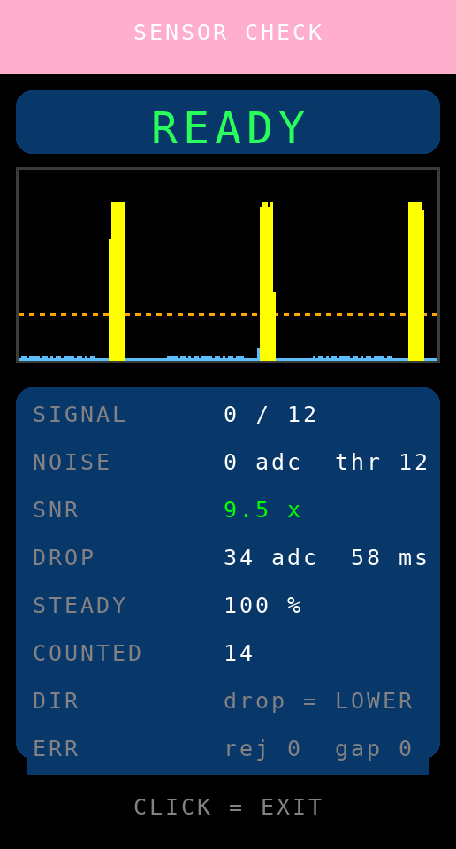
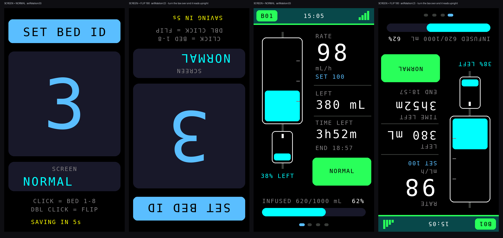

# Bed Station Node v7.7.3 — แก้สูตรคำนวณอัตราการไหลให้ตรงกับวิธีที่พยาบาลวัด

ต่อยอดจาก **Station v7.7.2** โดยแก้อย่างเดียวคือ **วิธีคำนวณอัตราการไหล**
การตรวจจับหยด หน้าจอ การหมุนจอ เสียงเตือน จังหวะส่ง ESP-NOW และโครงสร้าง
แพ็กเก็ต (Protocol v3) ไม่เปลี่ยนแม้แต่ไบต์เดียว ใช้คู่กับ Host รุ่นเดิมได้ทันที

## ปัญหาที่แก้ (ใหม่ใน v7.7.3)

### อาการ
ตัวเลข mL/h บนจอแกว่งแรง และเมื่อพยาบาลนับหยด 1 นาทีตามคู่มือแล้วเทียบกับจอ
มักได้ผลต่างเกินกรอบ **±10%** ที่คู่มือใช้ตัดสินการคาลิเบรต ทั้งที่เครื่องไม่ได้ผิดอะไร

### สาเหตุ — เฉลี่ย "ส่วนกลับ" ของเวลา

ของเดิมคำนวณอัตราไหลจากหยดแต่ละหยด แล้วเฉลี่ยแบบถ่วงน้ำหนัก

```cpp
instantGttMin   = 60000 / dropDeltaMs;            // อัตรา ณ ขณะนั้น
instantRateMlHr = instantGttMin * 60 / dropFactor;
currentFlowRate_ml_hr = instantRateMlHr * 0.75 + currentFlowRate_ml_hr * 0.25;
```

การเฉลี่ย `1/Δt` มีปัญหาสองข้อพร้อมกัน

1. **เอนสูงเสมอ** — ตามอสมการเจนเซน ค่าเฉลี่ยของส่วนกลับ ≥ ส่วนกลับของค่าเฉลี่ย
   ยิ่งหยดไม่สม่ำเสมอ ค่าที่อ่านได้ยิ่งสูงกว่าความจริง
2. **แกว่งแรง** — น้ำหนัก 0.75 เกาะค่าขณะนั้นเกือบเต็ม ความไม่สม่ำเสมอตามธรรมชาติ
   ของหยดจึงผ่านขึ้นจอเกือบทั้งหมด

ตัวอย่างจริง หยดสลับ 1.0 / 1.4 วินาที (เฉลี่ย 1.2 วินาที = **150 mL/h พอดี** ที่ DF 20)

```
i_a = 60000/1000 = 60.00 gtt/min      i_b = 60000/1400 = 42.86 gtt/min
x_a = 0.75·60.00 + 0.25·x_b  ->  56.57
x_b = 0.75·42.86 + 0.25·x_a  ->  46.28
จอแกว่ง 138.9 - 169.7 mL/h   (กรอบ ±10% คือ 135 - 165)
```

### วิธีแก้ — นับหยดจริงในหน้าต่างเวลา

```cpp
#define RATE_WINDOW_DROPS 8
// N ตัวอย่างเวลา = N-1 ช่วง = มีหยดตกจริง N-1 หยดในช่วงนั้น
mL/h = (N-1) / dropFactor * 3600000 / (t_ใหม่สุด - t_เก่าสุด)
```

เป็นวิธีเดียวกับที่พยาบาลนับหยด 1 นาที และเดียวกับที่ Host บันทึกลง Log รายนาที
(`entry.rateHr = minuteDrops / df * 60`) ตัวเลขทั้งสามจุดจึงตรงกันโดยนิยาม

หน้าต่างจะถูกล้างเมื่อจังหวะการไหลไม่ต่อเนื่องจริง ๆ เท่านั้น

| เหตุ | ทำไม |
|---|---|
| เริ่มถุงใหม่ / กลับจากหยุดชั่วคราว | ช่วงเวลาที่ขาดหายไม่ใช่การไหล |
| ช่วงหยด ≤ 55 ms หรือ ≥ `MAX_OCCLUSION_MS` | ช่วงผิดปกติ ไม่เอามาปน |
| ช่วงหยดต่างจากค่าเฉลี่ยในหน้าต่างเกิน 3 เท่า | พยาบาลหมุนโรลเลอร์แคลมป์ = เปลี่ยนอัตราก้าวกระโดด ทิ้งค่าเก่าทันทีไม่ให้ถ่วงจนตรวจจับช้า |
| ตรวจพบสายพับ | ค่าก่อนสายพับไม่ควรถ่วงค่าหลังแก้สายเสร็จ |

### ผลการทดสอบบนเครื่อง PC

ของจริง 150 mL/h (DF 20) วัดช่วงค่าที่อ่านได้หลังเข้าที่แล้ว

| รูปแบบการหยด | ของจริง | สูตรเดิม | สูตรใหม่ |
|---|---|---|---|
| สม่ำเสมอ 1200 ms | 150.0 | 150.0 – 150.0 ผ่าน | 150.0 – 150.0 ผ่าน |
| สลับ 1000/1400 ms | 150.0 | **138.9 – 169.7 หลุด ±10%** | 146.5 – 153.7 ผ่าน |
| สลับ 800/1600 ms | 150.0 | **135.0 – 202.5 หลุด ±10%** | 143.2 – 157.5 ผ่าน |
| ช้า 9000 ms | 20.0 | 20.0 – 20.0 ผ่าน | 20.0 – 20.0 ผ่าน |

เทียบกับสูตรที่ Host ใช้บันทึก Log: **ต่างกัน 0.000%**

---

## เอกสารเดิมจากรุ่นก่อนหน้า

ต่อยอดจาก **Station v7.7.1** โดยแก้อย่างเดียวคือ **จังหวะการส่งข้อมูลให้ Host**
ส่วนอื่นทั้งหมด (การตรวจจับหยด หน้าจอ การหมุนจอ เสียงเตือน) ไม่เปลี่ยนแม้แต่บรรทัดเดียว

ต่อยอดจาก **Station v7.7.0** (อัลกอริทึมตรวจจับหยดเหมือนเดิมทุกบรรทัด)
เพิ่มเฉพาะ **การหมุนจอ 180 องศา** เพื่อให้ติดตั้งกล่องได้ทั้งแบบสาย USB ลงล่างและขึ้นบน

ตัวอัลกอริทึมต่อยอดจาก **Station v7.5.1** โดยเปลี่ยน **อัลกอริทึมตรวจจับหยด** ทั้งหมด
หน้าจอ 4 หน้า การสื่อสาร ESP-NOW (Protocol v3) และการแจ้งเตือนเหมือนเดิมทุกไบต์
ใช้ผังขาเดิม (เซนเซอร์ที่ GPIO 4) และใช้คู่กับ Host v4.6.0 / v4.7.0 / v4.8.0 / v4.9.x ได้ทันที

## แก้อาการ Host ขึ้น OFFLINE เมื่อมีหลายเตียง (ใหม่ใน v7.7.2)

อาการ: มีหลายเตียงพร้อมกันแล้วจอ Station ยังขึ้น `ONLINE` ปกติ แต่ฝั่ง Host
ขึ้นว่าเตียงนั้น `OFFLINE` เป็นช่วง ๆ ยิ่งเตียงมากยิ่งบ่อย

### สาเหตุจริง — ไม่ใช่สัญญาณอ่อน แต่เป็นจังหวะส่งที่ชนกันค้าง

ของเดิมทุกสเตชันส่งข้อมูลทุก **1000 ms เป๊ะ ไม่มีการสุ่มเลย**

คริสตัลของบอร์ดสองตัวต่างกันราว 40 ppm = คาบส่งเลื่อนหากันเพียง **0.04 ms ต่อวินาที**
เฟรม ESP-NOW ขนาด 23 ไบต์ใช้เวลาออกอากาศราว **0.8 ms** ดังนั้นเมื่อสองเตียงบังเอิญ
ส่งห่างกันไม่ถึง 0.8 ms มันจะชนกัน **ค้างอยู่ราว 40 วินาที** กว่าจะเลื่อนพ้นกัน

```
2 x 0.8 ms / 0.04 ms ต่อวินาที = 40 วินาที
```

40 วินาที นานกว่าเกณฑ์ `ONLINE_TIMEOUT_MS` ของ Host หลายเท่า เตียงนั้นจึงหายไปจากจอ Host

### ทำไมจอ Station ถึงยังขึ้นว่าออนไลน์

Host ส่ง Sync **แยกใบต่อเตียง** มีกี่เตียงก็ส่งเท่านั้นใบต่อวินาที และโค้ดฝั่ง Station
ตั้ง `isHostOnline = true` ทุกใบที่รับได้ ไม่ว่าจะจ่าหน้าถึงเตียงใด (ดู `OnTimeSyncRecv`)

| ทิศทาง | แพ็กเก็ต/วินาที | ต้องหายติดกันกี่ใบจึงขึ้นว่าหลุด |
|---|---|---|
| Host -> Station | เท่าจำนวนเตียง (8 เตียง = 8 ใบ) | 40 ใบ |
| Station -> Host | 1 ใบเสมอ | 5 ใบ (Host รุ่นเดิม) |

ความทนทานต่างกัน 8 เท่า จึงเห็นอาการ "ข้างหนึ่งปกติ อีกข้างหลุด"

### วิธีแก้

```cpp
#define SEND_JITTER_MS  60      // สุ่มคาบส่งในช่วง 940-1060 ms

// หลังส่งทุกครั้ง สุ่มคาบถัดไปใหม่
nextSendDelay = (SEND_INTERVAL_MS - SEND_JITTER_MS) + random(0, 2 * SEND_JITTER_MS + 1);
```

* **สุ่มคาบใหม่ทุกครั้ง** — สองเตียงที่บังเอิญชนกันจะแยกจากกันในรอบถัดไปทันที
  ไม่ใช่รอ 40 วินาที
* **รอบแรกหลังบูตเหลื่อมตามเลขเตียง** (เตียงละ 111 ms) แพ็กเก็ตกระจายกันทั้งวินาที
  ตั้งแต่ต้น ไม่ต้องรอให้ jitter ค่อย ๆ แยก
* **เมล็ดสุ่มมาจาก MAC ของบอร์ด** จึงไม่ซ้ำกันแม้แฟลชเฟิร์มแวร์เดียวกันทุกตัว

อัตราการส่งเฉลี่ยยังเท่าเดิม (1 ใบ/วินาที) โครงสร้างแพ็กเก็ตไม่เปลี่ยน
**ใช้กับ Host รุ่นใดก็ได้ และใช้ปนกับสเตชันรุ่นเก่าได้**

### วัดผลได้

```bash
tools/link-sim/run.sh
```

| จำนวนเตียง | เวลาที่ Host ขึ้น OFFLINE ผิดพลาดใน 1 ชั่วโมง (เดิม) | (ใหม่) |
|---|---|---|
| 2 | 0 วินาที | 0 วินาที |
| 4 | 203 วินาที | **0 วินาที** |
| 6 | 712 วินาที | **0 วินาที** |
| 8 | 407 วินาที | **0 วินาที** |

แนะนำให้อัปเดต Host เป็น [`v4.7.3-OLED`](../**Host จอ OLED v4.7.3**/README.md) ด้วย
ซึ่งแก้ฝั่ง Host อีกสองจุด (เลิกยิง Sync เป็นชุด และวัดคุณภาพลิงก์ให้เห็น)


## สิ่งที่พยาบาลต้องทำ — เหลือ 2 ขั้น

1. หนีบเซนเซอร์ที่กระเปาะ ให้ลำแสงอยู่ **ต่ำกว่าปลายหัวหยดราว 3-5 มม.**
2. เปิดโรลเลอร์ให้น้ำหยด

จบ. ไม่มีเมนู ไม่มีขั้นตอน ไม่ต้องหยุดน้ำเพื่อวัดอะไร เครื่องจะเรียนรู้เองแล้วขึ้นสถานะ

| สถานะบนจอ | ความหมาย | ต้องทำอะไร |
|---|---|---|
| `STARTING` | เพิ่งเปิดเครื่อง กำลังตั้งตัว (ไม่กี่วินาที) | รอ |
| `LEARNING` | เห็นหยดแล้ว กำลังยืนยันจังหวะ | รออีกไม่กี่หยด |
| `READY` | จับหยดได้สม่ำเสมอ พร้อมใช้งาน | ใช้งานได้เลย |
| `CHECK SENSOR` | ไม่เห็นหยดเลยนานผิดปกติ | ขยับตำแหน่งเซนเซอร์ |

ค่าที่เรียนรู้ได้จะถูกบันทึกลง NVS เปิดเครื่องครั้งถัดไปจึงพร้อมใช้งานเร็วขึ้น

## ทำไมถึงเลิกใช้ Wizard ได้

Wizard เดิม (v7.5.x) บังคับให้ผู้ใช้ทำงานแบบวิศวกร — หยุดน้ำเพื่อวัดสัญญาณรบกวน
ดูค่า SNR แล้วตัดสินใจเอง เวอร์ชันนี้ย้ายภาระทั้งหมดไปให้อัลกอริทึม โดยอาศัยข้อเท็จจริง
ทางกายภาพ 3 ข้อของการให้สารน้ำ

1. **หยดเป็นสัญญาณสั้น** (ราว 5-30 ms) บนพื้นหลังที่เปลี่ยนช้ากว่ามาก
2. **หยดมีรูปร่างซ้ำเดิมทุกหยด** จึงเรียนรู้แล้วนำมาใช้เป็นแม่แบบได้
3. **หยดเกิดเป็นจังหวะกึ่งคาบ** จึงยืนยันได้เองว่ากำลังจับของจริงอยู่

## อัลกอริทึม (อยู่ใน `drop_detector.h` — ไม่ผูกกับ Arduino จึงทดสอบบน PC ได้)

```
ADC 2 kHz ─► มีเดียน 5 จุด ─► ค่าเฉลี่ยเคลื่อนที่ W จุด ─► ผลต่างอันดับสอง ─► edge
                                                              │
                          MAD (มัธยฐานแบบสตรีม) ──► sigma ──► เกณฑ์ CFAR = 6·sigma
                                                              │
            edge ─► ชมิตต์ทริกเกอร์ ─► ประตูความกว้าง ─► นับ ─► เรียนรู้ ─► ยืนยันจังหวะ
```

### 1. ผลต่างอันดับสอง — ตัวแก้ปัญหาถุงน้ำเกลือแกว่ง

```
edge(t) = 2·b(t−W) − b(t) − b(t−2W)        เมื่อ b คือค่าเฉลี่ยเคลื่อนที่ W จุด
```

นี่คือ **discrete Laplacian** ซึ่งตัดทั้งค่าคงที่และความชันคงที่ออกโดยโครงสร้าง
เหลือไว้เฉพาะ "ความโค้ง" ที่สเกลเดียวกับความกว้างพัลส์

* การแกว่งของถุงที่ 2 Hz แอมพลิจูด 150 ADC เหลือเพียงราว `A·(ω·Δt)² ≈ 1.7 ADC`
* พัลส์หยดกว้าง 12 ms ผ่านมาได้เต็ม และถูกขยายเป็นราว 2 เท่า

ได้อัตราส่วนแยกแยะราว **100 เท่า** โดยไม่ต้องตั้งเกณฑ์เอง และเพราะ DC ถูกตัดทิ้ง
โดยโครงสร้าง จึงไม่มีอาการ "เส้นฐานค้างจนไม่นับหยด" แบบที่พบใน v7.5.x อีกเลย

### 2. ตัวกรองจับคู่รูปคลื่น — ได้ SNR ฟรีราว 4 เท่า

ทฤษฎีการตรวจจับบอกว่า เมื่อสัญญาณรบกวนเป็นแบบขาว ตัวกรองที่ให้อัตราส่วนสัญญาณ
ต่อสัญญาณรบกวนสูงสุดคือตัวที่มีรูปร่างเหมือนสัญญาณที่จะตรวจจับ (matched filter)
พัลส์หยดมีรูปร่างซ้ำเดิม จึงประมาณด้วยค่าเฉลี่ยเคลื่อนที่ยาวเท่าความกว้างพัลส์
ได้กำไรราว `sqrt(N)` เท่า (N ≈ 19 ตัวอย่าง → ดีขึ้นราว 4.4 เท่า) **โดยไม่ต้องแก้ฮาร์ดแวร์เลย**

ความยาวตัวกรองมาจากความกว้างพัลส์ที่เรียนรู้ไว้ และมีการแก้ค่าที่วัดได้ก่อนนำไปใช้:
ความกว้างที่วัดได้คือความกว้าง ณ ระดับเกณฑ์ ไม่ใช่ความกว้างจริง สำหรับพัลส์ครึ่งไซน์
`w(f) = T·(1 − 2·asin(f)/π)` จึงย้อนกลับไปหา `T` จริงได้ ทำให้ตัวกรองไม่หดตัวลงเรื่อย ๆ

### 3. ประมาณสัญญาณรบกวนด้วยมัธยฐาน — จึงวัดได้ขณะน้ำกำลังหยด

ใช้ตัวติดตามมัธยฐานแบบสตรีม (frugal streaming median) ของ `|edge|` ได้ค่า MAD
แล้วแปลงเป็นค่าเบี่ยงเบนมาตรฐานด้วย `sigma = 1.4826 × MAD`

**จุดสำคัญ:** มัธยฐานไม่ถูกดึงโดยค่าผิดปกติ หยดกินเวลาเพียงไม่กี่เปอร์เซ็นต์ของตัวอย่าง
จึงไม่กระทบค่าที่วัดได้เลย — นี่คือเหตุผลที่ **ไม่ต้องให้ผู้ใช้หยุดน้ำเพื่อวัดพื้นสัญญาณรบกวน**
อีกต่อไป (ต่างจากขั้นที่ 1 ของ wizard เดิมที่ต้องขอให้ "อย่าให้มีหยด")

### 4. เกณฑ์แบบ CFAR — อัตราแจ้งเตือนผิดพลาดคงที่

ตั้งเกณฑ์ที่ `k·sigma` ตามหลัก Constant False Alarm Rate ของงานเรดาร์/โซนาร์
เมื่อ `k = 6` กับสัญญาณรบกวนแบบเกาส์ โอกาสผิดพลาดอยู่ที่ราว `1e-9` ต่อตัวอย่าง
(ที่ 2 kHz คือราว 1 ครั้งต่อ 6 วัน) และอัตรานี้ **คงที่เสมอ** ไม่ว่าสัญญาณรบกวนจะมากหรือน้อย
ผู้ใช้จึงไม่ต้องมาตั้งเกณฑ์เองอีก

### 5. ยืนยันด้วยความสม่ำเสมอของช่วงหยด

เก็บช่วงห่างระหว่างหยด 8 ค่าล่าสุด ถ้ามีอย่างน้อย 4 ค่าที่ต่างจากมัธยฐานไม่เกิน 30%
แปลว่ากำลังจับหยดจริง จึงขึ้นสถานะ `READY` ให้พยาบาลเห็น

ตัวนี้ยังใช้ **ตัดสินทิศสัญญาณเองด้วย**: เริ่มจากทิศที่พบบ่อยที่สุด (หยดบังลำแสง → ค่าลดลง)
ถ้าครบ 10 วินาทีแล้วยังยืนยันจังหวะไม่ได้ ก็สลับทิศแล้วลองใหม่ — เชื่อถือได้กว่า
การวิเคราะห์รูปสัญญาณช่วงสั้น ๆ มาก

## ผลทดสอบ

`tools/detector-test/run.sh` คอมไพล์อัลกอริทึมบนเครื่อง PC แล้วป้อนสัญญาณจำลอง
10 สถานการณ์ โดยไม่ต้องมีบอร์ด เกณฑ์ผ่านคือ **ห้ามนับเกิน** และขาดได้ไม่เกิน 1 หยด
(ข้ามข้อมูล 3 วินาทีแรกที่เครื่องกำลังตั้งตัว)

| สถานการณ์ | คาดหวัง | นับได้ |
|---|---|---|
| นิ่งปกติ | 19 | 19 |
| สัญญาณรบกวนแรง 120 ADC | 19 | 17 |
| หยดจาง (SNR ต่ำ) | 19 | 19 |
| ถุงแกว่ง 2 Hz ±150 ADC | 19 | 19 |
| ถุงแกว่ง 1 Hz ±300 ADC | 19 | 19 |
| ระดับสัญญาณไหล 20 ADC/s | 19 | 19 |
| ระดับสัญญาณไหล 100 ADC/s | 19 | 19 |
| วาดจอบล็อก 40 ms ทุก 150 ms | 11 | 11 |
| พัลส์สองลูกติดกัน (หัว+หางหยด) | 19 | 19 |
| หยดเร็ว 200 หยด/นาที | 57 | 57 |

ไม่มีสถานการณ์ใดที่นับเกิน (ไม่มีการนับเบิ้ล) และกรณีเดียวที่ขาดคือสัญญาณรบกวน
ระดับที่เกินขีดความสามารถของเซนเซอร์เอง (SNR ดิบเพียง 6.4 เท่า)

## หน้าตรวจเซนเซอร์ (สำหรับช่าง — กดปุ่มค้าง 3 วินาที)



ดูอย่างเดียว ไม่ต้องทำตามขั้นตอนใด ๆ กดอีกครั้งเพื่อออก

| แถว | ความหมาย |
|---|---|
| `SIGNAL` | ค่าปัจจุบัน / เกณฑ์ที่ใช้อยู่ |
| `NOISE` | สัญญาณรบกวนที่ประมาณได้ และเกณฑ์ |
| `SNR` | อัตราส่วนสัญญาณต่อสัญญาณรบกวน — ต่ำกว่า 3 เท่าควรขยับเซนเซอร์ |
| `DROP` | ความสูง/ความกว้างพัลส์ที่เรียนรู้ไว้ |
| `STEADY` | ความสม่ำเสมอของช่วงหยด (100% = จับจังหวะได้แม่น) |
| `COUNTED` | จำนวนหยดที่นับได้ตั้งแต่เข้าหน้านี้ |
| `DIR` | ทิศสัญญาณที่เครื่องเลือกเอง |
| `ERR` | พัลส์ที่ถูกคัดทิ้ง / จำนวนครั้งที่การอ่านขาดช่วง |

## ค่าที่ปรับได้ (`iv::DetectorConfig` ใน `drop_detector.h`)

| ฟิลด์ | ค่าเริ่มต้น | ปรับเมื่อ |
|---|---|---|
| `cfarK` | 6.0 | ลดลงถ้าหยดจางมากจนจับไม่ได้ (แลกกับโอกาสนับผิดสูงขึ้น) |
| `startWidthMs` | 12 | ความกว้างพัลส์โดยประมาณของเซนเซอร์ที่ใช้ |
| `maxWidthMs` | 150 | เซนเซอร์คืนตัวช้าจนพัลส์กว้างกว่านี้ |
| `rearmMs` | 20 | ยังนับเบิ้ล (แทบไม่ควรต้องปรับ) |
| `polarityTrialMs` | 10000 | เวลาที่ลองแต่ละทิศก่อนสลับ |
| `lockNeeded` | 4 | จำนวนช่วงหยดที่ต้องสม่ำเสมอก่อนขึ้น READY |

## หมุนจอ 180 องศา (ใหม่ใน v7.7.1)

ตอนติดตั้งจริง ทิศที่สายเซนเซอร์และสาย USB ออกจากกล่องเป็นตัวกำหนดว่ากล่องต้องวางท่าไหน
บางตำแหน่งวางแล้วจอกลับหัว เวอร์ชันนี้จึงสลับทิศจอได้ที่หน้าเครื่องโดยไม่ต้องแฟลชใหม่

**วิธีสลับ**

1. คลิกปุ่ม **3 ครั้ง** = เข้าหน้า `SET BED ID`
2. ในหน้านี้ **ดับเบิลคลิก** = สลับ `SCREEN: NORMAL` <-> `SCREEN: FLIP 180`
   จอพลิกให้เห็นผลทันที และบันทึกลง NVS ทันทีเช่นกัน
3. คลิกเดี่ยวยังเป็นการเปลี่ยนเลขเตียง 1-8 เหมือนเดิม ไม่กระทบของเดิม



ภาพคู่ขวาของแต่ละชุดคือสิ่งที่ออกจากจอเมื่อตั้ง `FLIP 180` — เมื่อพลิกกล่องกลับ
180 องศาตามการติดตั้งจริง จะอ่านได้ตรงตามปกติ

**ตั้งค่าเริ่มต้นตอนคอมไพล์** ถ้าทั้งวอร์ดติดตั้งกลับหัวเหมือนกันหมด แก้บรรทัดเดียว
แล้วแฟลชทีเดียวจบ (ค่าที่เคยตั้งที่หน้าเครื่องจะมีลำดับสูงกว่าเสมอ)

```cpp
#define TFT_ROTATION_DEFAULT  TFT_ROT_FLIP180   // เดิมเป็น TFT_ROT_NORMAL
```

**ทำไมเลย์เอาต์ไม่ต้องแก้แม้แต่บรรทัดเดียว**

จอ ST7789 ขนาด 172x320 ที่ `setRotation(0)` กับ `setRotation(2)` เป็น **แนวตั้ง
ขนาดเท่ากันทั้งคู่** ต่างกันแค่บิต `MX`/`MY` ในรีจิสเตอร์ `MADCTL` ของตัวคอนโทรลเลอร์
คือตัวชิปเป็นผู้กลับลำดับการสแกนแถวและคอลัมน์ให้เอง พิกัด `(x, y)` ทุกจุดที่โค้ดวาด
จึงมีความหมายเหมือนเดิมทั้งหมด (ถ้าเป็น `setRotation(1)` หรือ `(3)` จะกลายเป็นแนวนอน
320x172 ซึ่งต้องรื้อเลย์เอาต์ใหม่ทั้งไฟล์ — จึงไม่ใช้)

อีกจุดที่ต้องระวังคือ **ออฟเซ็ตคอลัมน์** เพราะคอนโทรลเลอร์ ST7789 กว้าง 240 พิกเซล
แต่หน้าจอจริงกว้าง 172 พิกเซล ภาพจึงต้องเลื่อนเข้ามา `(240-172)/2 = 34` พิกเซล
ไลบรารี Adafruit ตั้ง `_colstart = _colstart2 = 34` ให้แล้วเมื่อเรียก `init(172, 320)`
ทั้งสองทิศจึงใช้ออฟเซ็ตเท่ากัน ภาพไม่เลื่อนออกนอกจอ

โค้ดที่เพิ่มจริงมีเท่านี้

```cpp
void applyScreenRotation(uint8_t rot) {
  screenRotation = (rot == TFT_ROT_FLIP180) ? TFT_ROT_FLIP180 : TFT_ROT_NORMAL;
  tft.setRotation(screenRotation);
  tft.setTextWrap(false);
  tft.fillScreen(THEME_BG);
  stateNeedsRedraw = true;      // ให้ทุกหน้าวาดกรอบใหม่ทั้งหน้า
}
```

**ไม่กระทบสิ่งอื่นเลย** — การตรวจจับหยด การสื่อสาร ESP-NOW เสียงเตือน และค่าที่เรียนรู้
ไม่เกี่ยวข้องกับทิศจอแม้แต่จุดเดียว เป็นการเปลี่ยนที่ชั้นแสดงผลล้วน ๆ

## หมายเหตุ

* **ยังไม่ได้ทดสอบบนฮาร์ดแวร์จริง** — สิ่งที่ควรดู: เปิดเครื่องแล้วเปิดโรลเลอร์
  ควรขึ้น `READY` ภายในราว 5-10 วินาที ถ้าค้างที่ `LEARNING` ให้เปิดหน้า SENSOR CHECK
  ดูค่า SNR (ต่ำกว่า 3 เท่า = ต้องขยับเซนเซอร์) และ `ERR` (gap ที่เดินขึ้นเรื่อย ๆ
  แปลว่ามีอะไรกินเวลาในลูปหลักนานผิดปกติ)
* ภาพพรีวิวจากเครื่อง PC สุ่มตัวอย่างได้เพียงราว 500 Hz (จริง 2 kHz) ตัวเลข
  ความสูง/ความกว้างพัลส์ในภาพจึงไม่ตรงกับของจริง แต่พฤติกรรมการนับตรงกัน
* การหมุนจอยังไม่ได้ลองบนบอร์ดจริงเช่นกัน สิ่งที่ควรตรวจคือ ภาพต้องไม่เลื่อน
  ออกนอกขอบจอ (ถ้าเลื่อน แปลว่าโมดูลที่ใช้มีออฟเซ็ตไม่ใช่ 34 — แก้ที่ `tft.init()`)
* คำอธิบายการออกแบบหน้าจอทั้ง 4 หน้าอยู่ใน
  [README ของ v7.5.0](../**Station v7.5.0**/README.md)
